# User Flows

This document illustrates the key user journeys and interactions within the Workforce Automation App.

## User Types and Journeys

The application supports three primary user types, each with distinct journeys:

1. **Installer**: Field personnel performing equipment installation and service subscription
2. **Back Office**: Symphonics administrative staff managing companies, users, and interventions
3. **IT**: Technical staff managing system configuration and integration

## Installer Journeys

### 1. User Registration and Onboarding

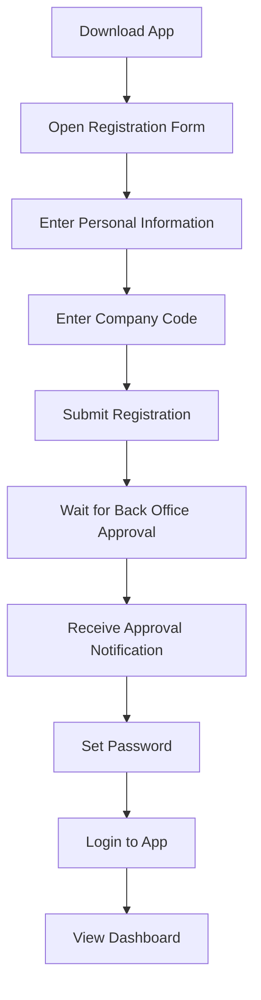

### 2. Intervention Creation and Completion

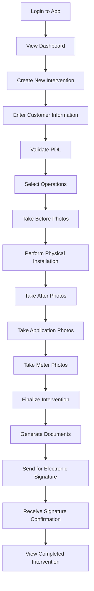

### 3. Intervention Management

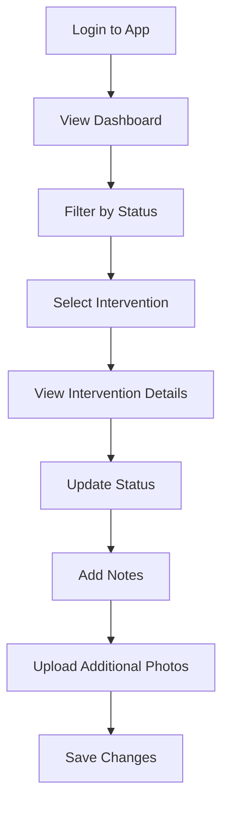

## Back Office Journeys

### 1. Company Account Creation

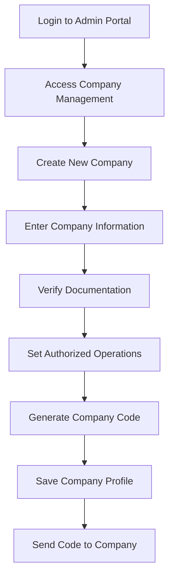

### 2. User Management

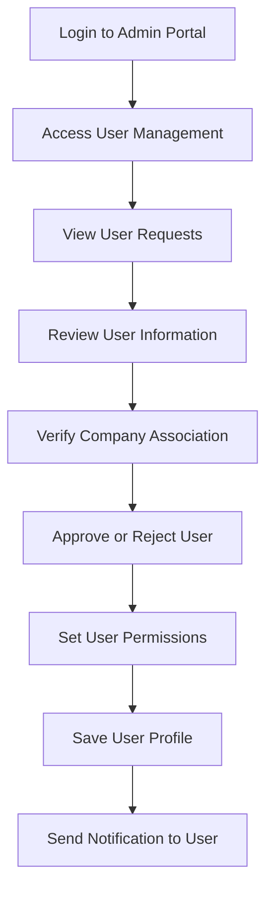

### 3. Intervention Administration

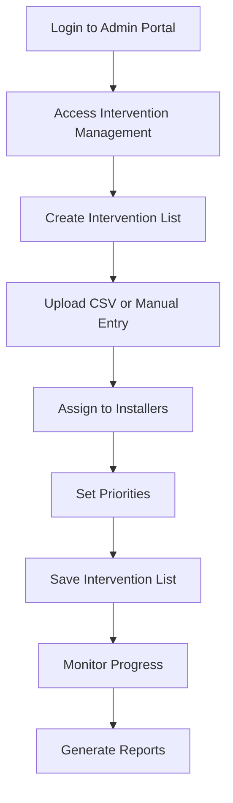

## IT Journeys

### 1. System Integration

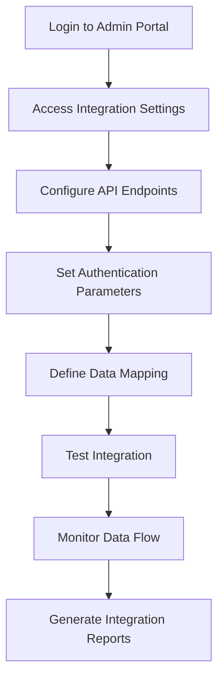

### 2. Document Template Management

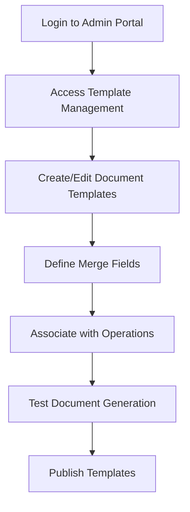

## Key Interaction Flows

### 1. PDL Validation Flow

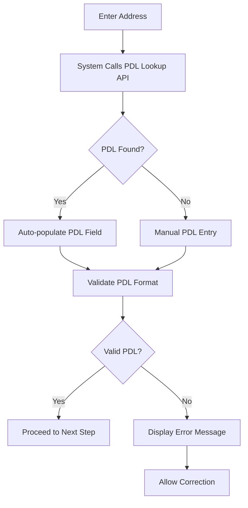

### 2. Photo Capture Flow

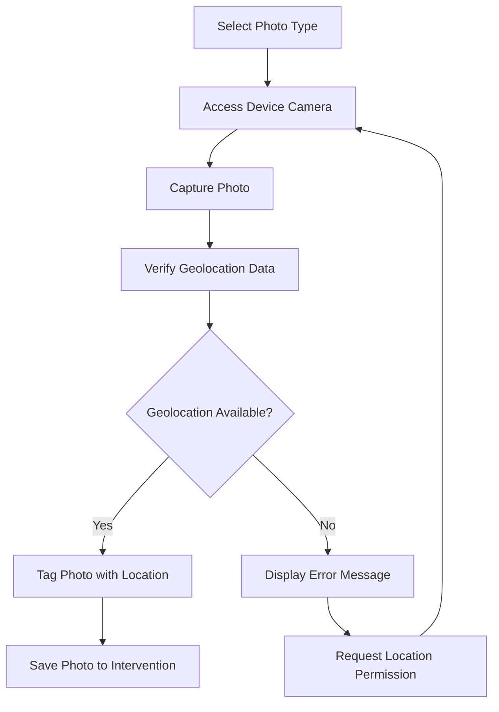

### 3. Document Generation and Signature Flow

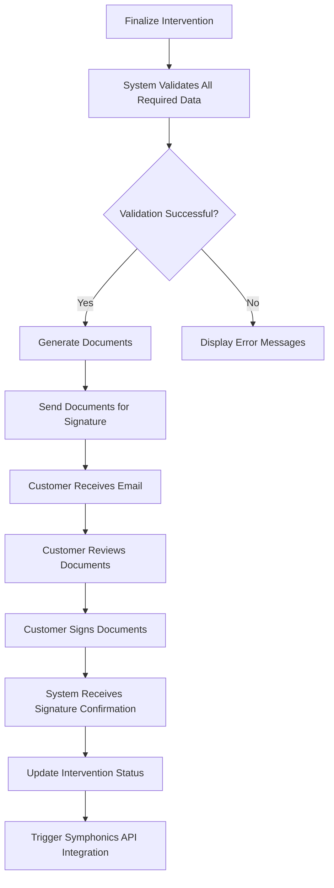

## Error Handling Flows

### 1. Network Connectivity Issues

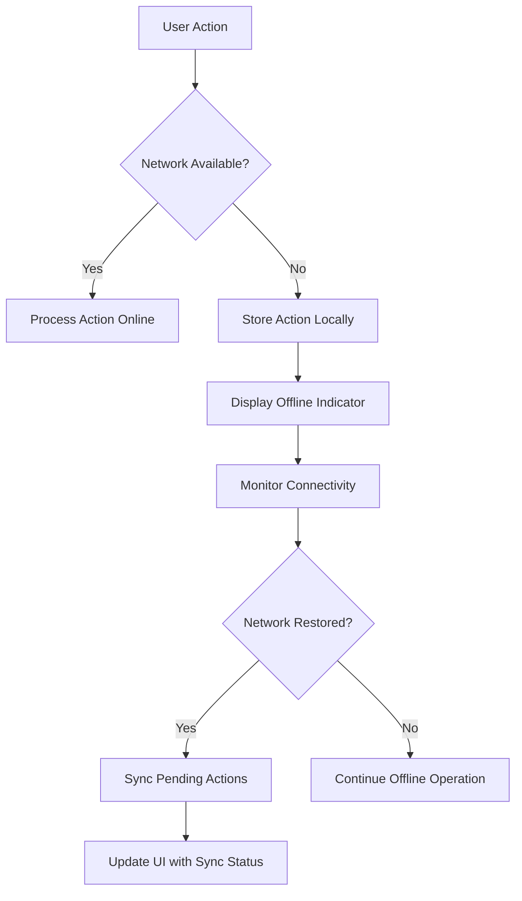

### 2. Validation Error Recovery

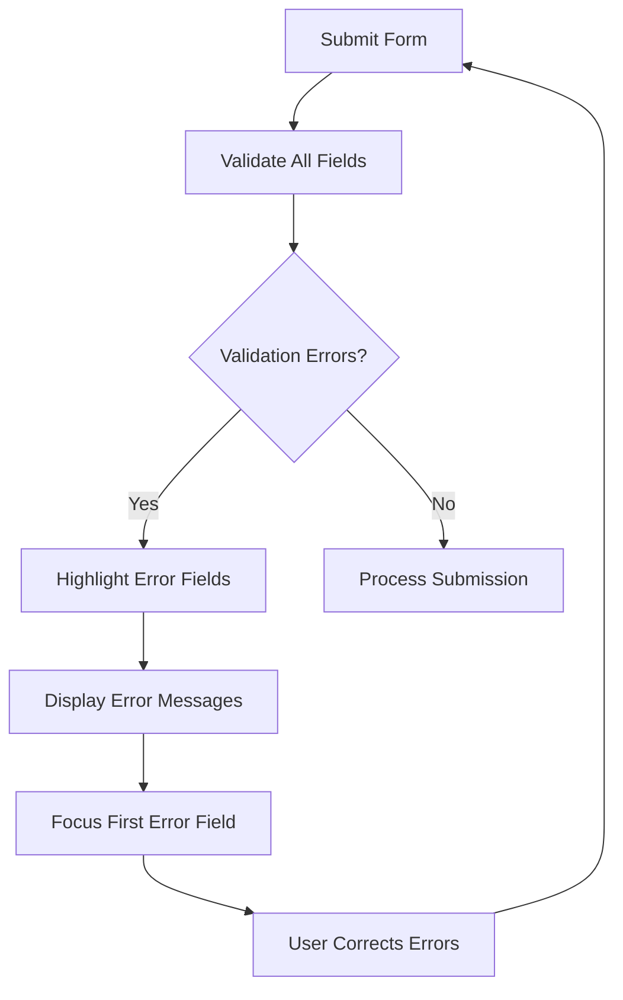

## Status Transition Flows

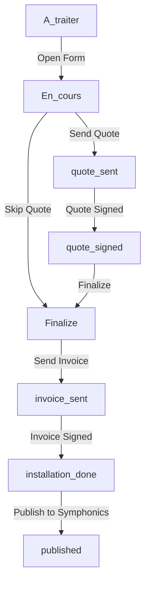

These user flows illustrate the primary interactions and journeys within the Workforce Automation App. They serve as a foundation for both UI design and technical implementation, ensuring a consistent and efficient user experience across all aspects of the application.
