# Intervention Administration Screen Wireframe

This wireframe illustrates the intervention administration screen for the Workforce Automation App, which allows administrators to manage, monitor, and assign interventions across all companies.

## Screen Layout

## Detailed Components

## State Transition Flow

## UI Mockup - Intervention List View

```mermaid
%%{init: {'theme': 'base', 'themeVariables': { 'primaryColor': '#f4f4f4', 'primaryTextColor': '#333', 'primaryBorderColor': '#ddd', 'lineColor': '#a0a0a0', 'secondaryColor': '#006699', 'tertiaryColor': '#fff'}}}%%
graph TD
    subgraph InterventionAdminScreen["Intervention Administration Screen"]
        subgraph Sidebar["Sidebar Navigation"]
            Logo["🔧"]
            NavDashboard["Dashboard"]
            NavCompanies["Companies"]
            NavUsers["Users"]
            NavInterventions["Interventions"]
            NavReports["Reports"]
            NavSettings["Settings"]
        end
        
        subgraph Header["Header"]
            Title["Intervention Administration"]
            CreateButton["[ + CREATE ]"]
            ImportButton["[ IMPORT ]"]
            ExportButton["[ EXPORT ]"]
            BulkAssignButton["[ BULK ASSIGN ]"]
            AdminInfo["Admin User ▼"]
        end
        
        subgraph Filters["Filters & Search"]
            SearchBar["🔍 Search interventions..."]
            StatusFilter["Status: All ▼"]
            CompanyFilter["Company: All ▼"]
            InstallerFilter["Installer: All ▼"]
            DateFilter["Date: All Time ▼"]
            AdvancedButton["Advanced Filters ▼"]
            ClearButton["Clear Filters"]
        end
        
        subgraph InterventionList["Intervention List"]
            subgraph TableHeader["Table Header"]
                HeaderCheckbox["[ ]"]
                HeaderCustomer["Customer ▼"]
                HeaderAddress["Address"]
                HeaderCompany["Company"]
                HeaderInstaller["Installer"]
                HeaderStatus["Status"]
                HeaderDate["Scheduled Date ▼"]
                HeaderActions["Actions"]
            end
            
            subgraph Intervention1["Intervention Row 1"]
                Int1Checkbox["[ ]"]
                Int1Customer["Thomas Martin"]
                Int1Address["45 Rue des Fleurs, 75015 Paris"]
                Int1Company["Électricité Plus"]
                Int1Installer["Jean Dupont"]
                Int1Status["En_cours"]
                Int1Date["Today, 14:30"]
                Int1Actions["[ VIEW ] [ EDIT ] [ ⋮ ]"]
            end
            
            subgraph Intervention2["Intervention Row 2"]
                Int2Checkbox["[ ]"]
                Int2Customer["Marie Dubois"]
                Int2Address["12 Avenue Victor Hugo, 75016 Paris"]
                Int2Company["Électricité Plus"]
                Int2Installer["Unassigned"]
                Int2Status["A_traiter"]
                Int2Date["Tomorrow, 10:00"]
                Int2Actions["[ VIEW ] [ EDIT ] [ ⋮ ]"]
            end
            
            subgraph Intervention3["Intervention Row 3"]
                Int3Checkbox["[ ]"]
                Int3Customer["Jean Dupont"]
                Int3Address["8 Rue de Rivoli, 75004 Paris"]
                Int3Company["Chauffage Expert"]
                Int3Installer["Pierre Leroy"]
                Int3Status["quote_sent"]
                Int3Date["Yesterday, 16:45"]
                Int3Actions["[ VIEW ] [ EDIT ] [ ⋮ ]"]
            end
        end
        
        subgraph Pagination["Pagination"]
            PrevButton["< Previous"]
            Page1["1"]
            Page2["2"]
            Page3["3"]
            NextButton["Next >"]
            ItemsPerPage["Items per page: 10 ▼"]
        end
    end
    
    NavDashboard --- NavCompanies
    NavCompanies --- NavUsers
    NavUsers --- NavInterventions
    NavInterventions --- NavReports
    NavReports --- NavSettings
    
    Title --- CreateButton
    CreateButton --- ImportButton
    ImportButton --- ExportButton
    ExportButton --- BulkAssignButton
    BulkAssignButton --- AdminInfo
    
    SearchBar --- StatusFilter
    StatusFilter --- CompanyFilter
    CompanyFilter --- InstallerFilter
    InstallerFilter --- DateFilter
    DateFilter --- AdvancedButton
    AdvancedButton --- ClearButton
    
    HeaderCheckbox --- HeaderCustomer
    HeaderCustomer --- HeaderAddress
    HeaderAddress --- HeaderCompany
    HeaderCompany --- HeaderInstaller
    HeaderInstaller --- HeaderStatus
    HeaderStatus --- HeaderDate
    HeaderDate --- HeaderActions
    
    Intervention1 --- Intervention2
    Intervention2 --- Intervention3
    
    PrevButton --- Page1
    Page1 --- Page2
    Page2 --- Page3
    Page3 --- NextButton
    NextButton --- ItemsPerPage
```

## UI Mockup - Intervention Detail Modal

```mermaid
%%{init: {'theme': 'base', 'themeVariables': { 'primaryColor': '#f4f4f4', 'primaryTextColor': '#333', 'primaryBorderColor': '#ddd', 'lineColor': '#a0a0a0', 'secondaryColor': '#006699', 'tertiaryColor': '#fff'}}}%%
graph TD
    subgraph InterventionDetailModal["Intervention Detail Modal"]
        subgraph ModalHeader["Modal Header"]
            ModalTitle["Edit Intervention: Thomas Martin"]
            CloseButton["×"]
        end
        
        subgraph Tabs["Form Tabs"]
            CustomerTab["Customer Info"]
            DetailsTab["Intervention Details"]
            AssignmentTab["Assignment"]
            HistoryTab["History"]
        end
        
        subgraph CustomerSection["Customer Information"]
            NameLabel["Name:"]
            NameInput["Thomas Martin"]
            EmailLabel["Email:"]
            EmailInput["thomas.martin@example.com"]
            PhoneLabel["Phone:"]
            PhoneInput["+33612345678"]
            AddressLabel["Address:"]
            AddressInput["45 Rue des Fleurs"]
            CityLabel["City:"]
            CityInput["Paris"]
            PostalLabel["Postal Code:"]
            PostalInput["75015"]
        end
        
        subgraph DetailsSection["Intervention Details"]
            PDLLabel["PDL:"]
            PDLInput["12345678901234"]
            StatusLabel["Status:"]
            StatusSelect["En_cours ▼"]
            DateLabel["Scheduled Date:"]
            DateInput["25/03/2025 14:30"]
            NotesLabel["Notes:"]
            NotesTextarea["Customer requested installation before noon. Access code for building: 1234."]
        end
        
        subgraph Actions["Actions"]
            SaveButton["[ SAVE CHANGES ]"]
            CancelButton["[ CANCEL ]"]
            DeleteButton["[ DELETE INTERVENTION ]"]
        end
    end
    
    ModalTitle --- CloseButton
    
    CustomerTab --- DetailsTab
    DetailsTab --- AssignmentTab
    AssignmentTab --- HistoryTab
    
    NameLabel --- NameInput
    NameInput --- EmailLabel
    EmailLabel --- EmailInput
    EmailInput --- PhoneLabel
    PhoneLabel --- PhoneInput
    PhoneInput --- AddressLabel
    AddressLabel --- AddressInput
    AddressInput --- CityLabel
    CityLabel --- CityInput
    CityInput --- PostalLabel
    PostalLabel --- PostalInput
    
    PDLLabel --- PDLInput
    PDLInput --- StatusLabel
    StatusLabel --- StatusSelect
    StatusSelect --- DateLabel
    DateLabel --- DateInput
    DateInput --- NotesLabel
    NotesLabel --- NotesTextarea
    
    SaveButton --- CancelButton
    CancelButton --- DeleteButton
```

## UI Mockup - Assignment Tab

```mermaid
%%{init: {'theme': 'base', 'themeVariables': { 'primaryColor': '#f4f4f4', 'primaryTextColor': '#333', 'primaryBorderColor': '#ddd', 'lineColor': '#a0a0a0', 'secondaryColor': '#006699', 'tertiaryColor': '#fff'}}}%%
graph TD
    subgraph AssignmentTab["Assignment Tab"]
        subgraph AssignmentHeader["Assignment Header"]
            AssignmentTitle["Intervention Assignment"]
        end
        
        subgraph CompanySection["Company Assignment"]
            CompanyLabel["Company:"]
            CompanySelect["Électricité Plus ▼"]
            CompanyInfo["Company Code: ELECPLUS | Status: Active | Region: Paris"]
        end
        
        subgraph InstallerSection["Installer Assignment"]
            InstallerLabel["Assigned Installer:"]
            InstallerSelect["Jean Dupont ▼"]
            InstallerInfo["Role: Installer | Status: Active | Interventions: 12"]
        end
        
        subgraph SchedulingSection["Scheduling"]
            ScheduleLabel["Scheduled Date:"]
            ScheduleInput["25/03/2025"]
            TimeLabel["Scheduled Time:"]
            TimeInput["14:30"]
            PriorityLabel["Priority:"]
            PrioritySelect["Normal ▼"]
        end
        
        subgraph NotificationSection["Notifications"]
            NotifyInstallerCheck["[✓] Notify installer of assignment"]
            NotifyCustomerCheck["[ ] Notify customer of scheduled date"]
            NotificationMessage["Optional message:"]
            MessageTextarea["Please complete this intervention as scheduled."]
        end
    end
    
    AssignmentTitle
    
    CompanyLabel --- CompanySelect
    CompanySelect --- CompanyInfo
    
    InstallerLabel --- InstallerSelect
    InstallerSelect --- InstallerInfo
    
    ScheduleLabel --- ScheduleInput
    ScheduleInput --- TimeLabel
    TimeLabel --- TimeInput
    TimeInput --- PriorityLabel
    PriorityLabel --- PrioritySelect
    
    NotifyInstallerCheck --- NotifyCustomerCheck
    NotifyCustomerCheck --- NotificationMessage
    NotificationMessage --- MessageTextarea
```

## UI Mockup - History Tab

```mermaid
%%{init: {'theme': 'base', 'themeVariables': { 'primaryColor': '#f4f4f4', 'primaryTextColor': '#333', 'primaryBorderColor': '#ddd', 'lineColor': '#a0a0a0', 'secondaryColor': '#006699', 'tertiaryColor': '#fff'}}}%%
graph TD
    subgraph HistoryTab["History Tab"]
        subgraph HistoryHeader["History Header"]
            HistoryTitle["Intervention History"]
            ExportHistoryButton["[ EXPORT HISTORY ]"]
        end
        
        subgraph HistoryList["History List"]
            subgraph History1["History Entry"]
                Hist1Time["Today, 09:30"]
                Hist1User["Jean Dupont (Installer)"]
                Hist1Action["Status Change"]
                Hist1Details["Changed status from 'A_traiter' to 'En_cours'"]
            end
            
            subgraph History2["History Entry"]
                Hist2Time["Today, 09:15"]
                Hist2User["Jean Dupont (Installer)"]
                Hist2Action["Assignment"]
                Hist2Details["Intervention assigned to Jean Dupont"]
            end
            
            subgraph History3["History Entry"]
                Hist3Time["Yesterday, 14:30"]
                Hist3User["Admin User (Administrator)"]
                Hist3Action["Creation"]
                Hist3Details["Intervention created and assigned to Électricité Plus"]
            end
            
            subgraph History4["History Entry"]
                Hist4Time["Yesterday, 14:30"]
                Hist4User["System"]
                Hist4Action["Import"]
                Hist4Details["Intervention imported from CSV batch #1234"]
            end
        end
    end
    
    HistoryTitle --- ExportHistoryButton
    
    History1 --- History2
    History2 --- History3
    History3 --- History4
```

## UI Mockup - Bulk Assign Modal

```mermaid
%%{init: {'theme': 'base', 'themeVariables': { 'primaryColor': '#f4f4f4', 'primaryTextColor': '#333', 'primaryBorderColor': '#ddd', 'lineColor': '#a0a0a0', 'secondaryColor': '#006699', 'tertiaryColor': '#fff'}}}%%
graph TD
    subgraph BulkAssignModal["Bulk Assign Modal"]
        subgraph BulkHeader["Modal Header"]
            BulkTitle["Bulk Assign Interventions"]
            BulkCloseButton["×"]
        end
        
        subgraph SelectionSection["Selection"]
            SelectionCount["3 interventions selected"]
            SelectionList["Thomas Martin, Marie Dubois, Jean Dupont"]
            ChangeSelectionButton["[ CHANGE SELECTION ]"]
        end
        
        subgraph AssignmentOptions["Assignment Options"]
            CompanyBulkLabel["Company:"]
            CompanyBulkSelect["Électricité Plus ▼"]
            InstallerBulkLabel["Assign to Installer:"]
            InstallerBulkSelect["Jean Dupont ▼"]
            DateBulkLabel["Schedule Date:"]
            DateBulkInput["25/03/2025"]
            TimeBulkLabel["Schedule Time:"]
            TimeBulkInput["14:30"]
            NotifyBulkCheck["[✓] Notify installers of assignment"]
        end
        
        subgraph BulkActions["Actions"]
            AssignButton["[ ASSIGN INTERVENTIONS ]"]
            CancelAssignButton["[ CANCEL ]"]
        end
    end
    
    BulkTitle --- BulkCloseButton
    
    SelectionCount --- SelectionList
    SelectionList --- ChangeSelectionButton
    
    CompanyBulkLabel --- CompanyBulkSelect
    CompanyBulkSelect --- InstallerBulkLabel
    InstallerBulkLabel --- InstallerBulkSelect
    InstallerBulkSelect --- DateBulkLabel
    DateBulkLabel --- DateBulkInput
    DateBulkInput --- TimeBulkLabel
    TimeBulkLabel --- TimeBulkInput
    TimeBulkInput --- NotifyBulkCheck
    
    AssignButton --- CancelAssignButton
```

## UI Mockup - Import Modal

```mermaid
%%{init: {'theme': 'base', 'themeVariables': { 'primaryColor': '#f4f4f4', 'primaryTextColor': '#333', 'primaryBorderColor': '#ddd', 'lineColor': '#a0a0a0', 'secondaryColor': '#006699', 'tertiaryColor': '#fff'}}}%%
graph TD
    subgraph ImportModal["Import Modal"]
        subgraph ImportHeader["Modal Header"]
            ImportTitle["Import Interventions"]
            ImportCloseButton["×"]
        end
        
        subgraph UploadSection["File Upload"]
            UploadInstructions["Upload a CSV or Excel file with intervention data"]
            UploadButton["[ CHOOSE FILE ]"]
            UploadStatus["No file selected"]
            TemplateLink["Download template file"]
        end
        
        subgraph MappingSection["Field Mapping"]
            MappingInstructions["Map columns from your file to intervention fields"]
            
            subgraph MappingRow1["Mapping Row"]
                Field1["Customer Name:"]
                FieldMap1["Column 'Name' ▼"]
            end
            
            subgraph MappingRow2["Mapping Row"]
                Field2["Email:"]
                FieldMap2["Column 'Email' ▼"]
            end
            
            subgraph MappingRow3["Mapping Row"]
                Field3["Phone:"]
                FieldMap3["Column 'Phone' ▼"]
            end
            
            subgraph MappingRow4["Mapping Row"]
                Field4["Address:"]
                FieldMap4["Column 'Address' ▼"]
            end
            
            subgraph MappingRow5["Mapping Row"]
                Field5["PDL:"]
                FieldMap5["Column 'PDL' ▼"]
            end
            
            subgraph MappingRow6["Mapping Row"]
                Field6["Company:"]
                FieldMap6["Électricité Plus (All rows) ▼"]
            end
        end
        
        subgraph ValidationSection["Validation Results"]
            ValidationStatus["Ready to import 25 interventions"]
            ValidationWarning["3 rows have validation warnings"]
            ViewWarningsButton["[ VIEW WARNINGS ]"]
        end
        
        subgraph ImportActions["Actions"]
            StartImportButton["[ START IMPORT ]"]
            CancelImportButton["[ CANCEL ]"]
        end
    end
    
    ImportTitle --- ImportCloseButton
    
    UploadInstructions --- UploadButton
    UploadButton --- UploadStatus
    UploadStatus --- TemplateLink
    
    MappingInstructions --- MappingRow1
    MappingRow1 --- MappingRow2
    MappingRow2 --- MappingRow3
    MappingRow3 --- MappingRow4
    MappingRow4 --- MappingRow5
    MappingRow5 --- MappingRow6
    
    Field1 --- FieldMap1
    Field2 --- FieldMap2
    Field3 --- FieldMap3
    Field4 --- FieldMap4
    Field5 --- FieldMap5
    Field6 --- FieldMap6
    
    ValidationStatus --- ValidationWarning
    ValidationWarning --- ViewWarningsButton
    
    StartImportButton --- CancelImportButton
```

## Specifications

### Layout Specifications
- **Screen Size**: Optimized for desktop (responsive down to tablet)
- **Sidebar Width**: 240px (collapsible to 64px)
- **Header Height**: 64px
- **Filters Height**: 60px
- **Table Row Height**: 56px
- **Modal Width**: 800px (responsive)
- **Modal Max Height**: 80% of viewport height

### Component Specifications

#### Sidebar
- **Logo**: Company logo (SVG format, 32px)
- **Navigation Items**: 
  - Dashboard
  - Companies
  - Users
  - Interventions (active)
  - Reports
  - Settings
- **Active Item**: Primary color background (#006699), white text
- **Inactive Items**: Gray text (#333333)
- **Collapse Button**: Arrow icon to collapse/expand sidebar

#### Header
- **Title**: "Intervention Administration" (24px Roboto Medium)
- **Create Button**: "+ CREATE" (14px Roboto Medium)
  - Primary color background (#006699), white text
  - Rounded corners (4px)
- **Import Button**: "IMPORT" (14px Roboto Medium)
  - White background, primary color border and text
  - Rounded corners (4px)
- **Export Button**: "EXPORT" (14px Roboto Medium)
  - White background, primary color border and text
  - Rounded corners (4px)
- **Bulk Assign Button**: "BULK ASSIGN" (14px Roboto Medium)
  - White background, primary color border and text
  - Rounded corners (4px)
- **User Info**: Username with dropdown for profile actions

#### Filters
- **Search Bar**: Full-width text input with search icon
- **Status Filter**: Dropdown with options (All, A_traiter, En_cours, etc.)
- **Company Filter**: Dropdown with companies
- **Installer Filter**: Dropdown with installers (including "Unassigned")
- **Date Filter**: Dropdown with date range options
- **Advanced Filters**: Expandable section with additional filters
- **Clear Filters**: Text button to reset all filters

#### Intervention List
- **Table Header**: Column headers with sort indicators
  - Checkbox for bulk selection
  - Customer Name (sortable)
  - Address
  - Company
  - Installer
  - Status
  - Scheduled Date (sortable, default sort)
  - Actions
- **Intervention Row**: Data row with intervention information
  - Alternating row background for better readability
  - Hover state with light highlight
- **Status Indicator**:
  - A_traiter: Orange (#FFA500)
  - En_cours: Blue (#1E90FF)
  - quote_sent: Purple (#9370DB)
  - quote_signed: Teal (#008080)
  - invoice_sent: Pink (#FF69B4)
  - installation_done: Green (#28a745)
  - published: Dark Green (#006400)
  - canceled: Red (#DC3545)
- **Action Buttons**: "VIEW", "EDIT", and dropdown menu for additional actions

#### Pagination
- **Page Numbers**: Current page highlighted
- **Previous/Next Buttons**: Enabled/disabled based on current page
- **Items Per Page**: Dropdown selector (10, 25, 50, 100)

#### Intervention Detail Modal
- **Header**: Title with close button
- **Tabs**: Customer Info, Intervention Details, Assignment, History
- **Form Fields**: Appropriate inputs for each data type
  - Text inputs: Customer name, email, phone, address
  - Dropdown: Status
  - Date/time picker: Scheduled date
  - Textarea: Notes
- **Action Buttons**:
  - Save: Primary color background (#006699), white text
  - Cancel: White background, gray border and text
  - Delete: Red background (#DC3545), white text (with confirmation)

#### Bulk Assign Modal
- **Header**: Title with close button
- **Selection Section**: Shows count and list of selected interventions
- **Assignment Options**:
  - Company dropdown
  - Installer dropdown
  - Date/time pickers
  - Notification checkbox
- **Action Buttons**:
  - Assign: Primary color background (#006699), white text
  - Cancel: White background, gray border and text

#### Import Modal
- **Header**: Title with close button
- **Upload Section**: File upload button and template download link
- **Mapping Section**: Field mapping dropdowns for each required field
- **Validation Section**: Import status and warnings
- **Action Buttons**:
  - Import: Primary color background (#006699), white text
  - Cancel: White background, gray border and text

### Behavior Specifications

1. **Intervention List**:
   - Sortable columns (click header to sort)
   - Filterable by search term, status, company, installer, and date
   - Checkbox selection for bulk actions
   - Pagination for large datasets
   - Click row or "VIEW" button to view details
   - Click "EDIT" button to open edit modal
   - Dropdown menu for additional actions (reassign, cancel, etc.)

2. **Create Intervention**:
   - Click "+ CREATE" to open empty form modal
   - Form validation for required fields
   - Option to assign to company and installer
   - Success notification on creation

3. **Edit Intervention**:
   - Form pre-populated with intervention data
   - Validation for required fields
   - Success notification on save
   - Confirmation dialog for status changes

4. **Bulk Assign**:
   - Select interventions using checkboxes
   - Click "BULK ASSIGN" to open modal
   - Select company, installer, and schedule
   - Confirmation before assignment
   - Success notification after assignment

5. **Import Interventions**:
   - Upload CSV or Excel file
   - Map columns to intervention fields
   - Validate data before import
   - Show warnings for potential issues
   - Progress indicator during import
   - Summary report after import

6. **Export Interventions**:
   - Export filtered list to CSV/Excel
   - Option to select columns for export
   - Download generated file

### Status-Based UI Adaptations

The interface adapts based on the intervention status:

1. **A_traiter**:
   - Orange status indicator
   - All fields editable
   - Assignment options available

2. **En_cours**:
   - Blue status indicator
   - Limited field editing
   - Status change options available

3. **quote_sent/quote_signed/invoice_sent**:
   - Purple/Teal/Pink status indicator
   - Document status information displayed
   - Limited editing capabilities

4. **installation_done**:
   - Green status indicator
   - Symphonics publishing options available
   - Very limited editing capabilities

5. **published**:
   - Dark Green status indicator
   - Symphonics reference number displayed
   - Read-only mode

6. **canceled**:
   - Red status indicator
   - Reason for cancellation displayed
   - Option to reactivate

### Responsive Behavior

- On smaller desktop screens:
  - Sidebar collapses to icons only
  - Table adapts with horizontal scrolling
  - Modal width reduces to fit screen

- On tablet:
  - Sidebar becomes a hamburger menu
  - Filters stack vertically
  - Table shows fewer columns with option to expand

### Accessibility Considerations

1. **Color Contrast**:
   - All text meets WCAG AA standards for contrast
   - Status indicators have text alternatives

2. **Keyboard Navigation**:
   - Logical tab order
   - Focus indicators for all interactive elements
   - Keyboard shortcuts for common actions

3. **Screen Readers**:
   - All form elements have proper labels
   - Table has appropriate ARIA attributes
   - Modal announces opening and closing
   - Status changes are announced

### Data Management

1. **Data Loading**:
   - Progressive loading for large datasets
   - Skeleton screens during initial load
   - Cached data for recently viewed interventions

2. **Data Validation**:
   - Client-side validation for immediate feedback
   - Server-side validation for security
   - Detailed error messages for validation failures

3. **Data Import/Export**:
   - Template files for standardized imports
   - Field mapping for flexible imports
   - Validation before import
   - Configurable exports

4. **Audit Logging**:
   - All changes logged with timestamp and user
   - History tab shows complete audit trail
   - Exportable audit logs

## Implementation Notes

1. Use a responsive grid system for layout
2. Implement proper form validation with clear error messages
3. Use optimistic UI updates for better perceived performance
4. Implement proper error handling for API failures
5. Use appropriate loading states for asynchronous operations
6. Ensure all actions have appropriate confirmation dialogs
7. Implement audit logging for intervention management actions
8. Use proper authorization checks for administrative actions
9. Implement efficient bulk operations for large datasets
10. Ensure import/export functionality handles large files efficiently
