# User Management Screen Wireframe

This wireframe illustrates the user management screen for the Workforce Automation App, which allows administrators to create, view, edit, and manage user accounts across all companies.

## Screen Layout

## Detailed Components

## State Transition Flow

## UI Mockup - User List View

## UI Mockup - User Detail Modal

```mermaid
%%{init: {'theme': 'base', 'themeVariables': { 'primaryColor': '#f4f4f4', 'primaryTextColor': '#333', 'primaryBorderColor': '#ddd', 'lineColor': '#a0a0a0', 'secondaryColor': '#006699', 'tertiaryColor': '#fff'}}}%%
graph TD
    subgraph UserDetailModal["User Detail Modal"]
        subgraph ModalHeader["Modal Header"]
            ModalTitle["Edit User: Jean Dupont"]
            CloseButton["×"]
        end
        
        subgraph Tabs["Form Tabs"]
            PersonalTab["Personal Info"]
            AccountTab["Account"]
            PermissionsTab["Permissions"]
            ActivityTab["Activity Log"]
        end
        
        subgraph PersonalSection["Personal Information"]
            FirstNameLabel["First Name:"]
            FirstNameInput["Jean"]
            LastNameLabel["Last Name:"]
            LastNameInput["Dupont"]
            EmailLabel["Email:"]
            EmailInput["jean.dupont@electriciteplus.fr"]
            PhoneLabel["Phone:"]
            PhoneInput["+33612345678"]
        end
        
        subgraph AccountSection["Account Information"]
            StatusLabel["Status:"]
            StatusToggle["● Active ○ Inactive ○ Pending"]
            RoleLabel["Role:"]
            RoleSelect["Admin ▼"]
            CompanyLabel["Company:"]
            CompanySelect["Électricité Plus ▼"]
            PasswordLabel["Password:"]
            PasswordButton["[ RESET PASSWORD ]"]
            LastLoginLabel["Last Login:"]
            LastLoginValue["Today, 09:45 from 192.168.1.1"]
        end
        
        subgraph Actions["Actions"]
            SaveButton["[ SAVE CHANGES ]"]
            CancelButton["[ CANCEL ]"]
            DeleteButton["[ DELETE USER ]"]
        end
    end
    
    ModalTitle --- CloseButton
    
    PersonalTab --- AccountTab
    AccountTab --- PermissionsTab
    PermissionsTab --- ActivityTab
    
    FirstNameLabel --- FirstNameInput
    FirstNameInput --- LastNameLabel
    LastNameLabel --- LastNameInput
    LastNameInput --- EmailLabel
    EmailLabel --- EmailInput
    EmailInput --- PhoneLabel
    PhoneLabel --- PhoneInput
    
    StatusLabel --- StatusToggle
    StatusToggle --- RoleLabel
    RoleLabel --- RoleSelect
    RoleSelect --- CompanyLabel
    CompanyLabel --- CompanySelect
    CompanySelect --- PasswordLabel
    PasswordLabel --- PasswordButton
    PasswordButton --- LastLoginLabel
    LastLoginLabel --- LastLoginValue
    
    SaveButton --- CancelButton
    CancelButton --- DeleteButton
```

## UI Mockup - Permissions Tab

```mermaid
%%{init: {'theme': 'base', 'themeVariables': { 'primaryColor': '#f4f4f4', 'primaryTextColor': '#333', 'primaryBorderColor': '#ddd', 'lineColor': '#a0a0a0', 'secondaryColor': '#006699', 'tertiaryColor': '#fff'}}}%%
graph TD
    subgraph PermissionsTab["Permissions Tab"]
        subgraph PermissionsHeader["Permissions Header"]
            PermissionsTitle["User Permissions"]
            RoleTemplateSelect["Role Template: Admin ▼"]
            CustomizeNote["Customizing permissions will override the role template."]
        end
        
        subgraph PermissionsList["Permissions List"]
            subgraph InterventionSection["Intervention Permissions"]
                IntervCreate["[✓] Create interventions"]
                IntervView["[✓] View interventions"]
                IntervEdit["[✓] Edit interventions"]
                IntervDelete["[✓] Delete interventions"]
                IntervPublish["[✓] Publish to Symphonics"]
            end
            
            subgraph CompanySection["Company Permissions"]
                CompanyView["[✓] View company details"]
                CompanyEdit["[✓] Edit company details"]
                CompanyUsers["[✓] Manage company users"]
                CompanyOps["[✓] Manage company operations"]
            end
            
            subgraph AdminSection["Administrative Permissions"]
                AdminUsers["[✓] Manage all users"]
                AdminCompanies["[✓] Manage all companies"]
                AdminSettings["[✓] Manage system settings"]
                AdminReports["[✓] Access all reports"]
            end
        end
    end
    
    PermissionsTitle --- RoleTemplateSelect
    RoleTemplateSelect --- CustomizeNote
    
    IntervCreate --- IntervView
    IntervView --- IntervEdit
    IntervEdit --- IntervDelete
    IntervDelete --- IntervPublish
    
    CompanyView --- CompanyEdit
    CompanyEdit --- CompanyUsers
    CompanyUsers --- CompanyOps
    
    AdminUsers --- AdminCompanies
    AdminCompanies --- AdminSettings
    AdminSettings --- AdminReports
```

## UI Mockup - Activity Log Tab

## Specifications

### Layout Specifications
- **Screen Size**: Optimized for desktop (responsive down to tablet)
- **Sidebar Width**: 240px (collapsible to 64px)
- **Header Height**: 64px
- **Filters Height**: 60px
- **Table Row Height**: 56px
- **Modal Width**: 800px (responsive)
- **Modal Max Height**: 80% of viewport height

### Component Specifications

#### Sidebar
- **Logo**: Company logo (SVG format, 32px)
- **Navigation Items**: 
  - Dashboard
  - Companies
  - Users (active)
  - Interventions
  - Reports
  - Settings
- **Active Item**: Primary color background (#006699), white text
- **Inactive Items**: Gray text (#333333)
- **Collapse Button**: Arrow icon to collapse/expand sidebar

#### Header
- **Title**: "User Management" (24px Roboto Medium)
- **Create Button**: "+ CREATE USER" (14px Roboto Medium)
  - Primary color background (#006699), white text
  - Rounded corners (4px)
- **Export Button**: "EXPORT" (14px Roboto Medium)
  - White background, primary color border and text
  - Rounded corners (4px)
- **User Info**: Username with dropdown for profile actions

#### Filters
- **Search Bar**: Full-width text input with search icon
- **Status Filter**: Dropdown with options (All, Active, Inactive, Pending)
- **Role Filter**: Dropdown with roles (All, Admin, Installer)
- **Company Filter**: Dropdown with companies
- **Date Filter**: Dropdown with date range options
- **Clear Filters**: Text button to reset all filters

#### User List
- **Table Header**: Column headers with sort indicators
  - Name (sortable, default sort)
  - Email
  - Role
  - Company
  - Status
  - Last Login (sortable)
  - Actions
- **User Row**: Data row with user information
  - Alternating row background for better readability
  - Hover state with light highlight
- **User Avatar**: Circular user profile image or initials
- **Status Indicator**:
  - Active: Green dot or pill
  - Inactive: Gray dot or pill
  - Pending: Orange dot or pill
- **Action Buttons**: "VIEW" and "EDIT" text buttons

#### Pagination
- **Page Numbers**: Current page highlighted
- **Previous/Next Buttons**: Enabled/disabled based on current page
- **Items Per Page**: Dropdown selector (10, 25, 50, 100)

#### User Detail Modal
- **Header**: Title with close button
- **Tabs**: Personal Info, Account, Permissions, Activity Log
- **Form Fields**: Appropriate inputs for each data type
  - Text inputs: First name, last name, email, phone
  - Radio buttons: Status
  - Dropdowns: Role, Company
  - Checkboxes: Permissions
- **Action Buttons**:
  - Save: Primary color background (#006699), white text
  - Cancel: White background, gray border and text
  - Delete: Red background (#DC3545), white text (with confirmation)

### Behavior Specifications

1. **User List**:
   - Sortable columns (click header to sort)
   - Filterable by search term, status, role, company, and date
   - Pagination for large datasets
   - Click row or "VIEW" button to view details
   - Click "EDIT" button to open edit modal

2. **Create User**:
   - Click "+ CREATE USER" to open empty form modal
   - Form validation for required fields
   - Email must be unique (validated on submit)
   - Option to send welcome email with temporary password
   - Success notification on creation

3. **Edit User**:
   - Form pre-populated with user data
   - Validation for required fields
   - Success notification on save
   - Confirmation dialog for status changes

4. **Reset Password**:
   - Confirmation dialog before resetting
   - Option to send reset email or generate temporary password
   - Success notification after reset

5. **Delete User**:
   - Confirmation dialog with warning about data loss
   - Success notification on deletion
   - Redirect to user list after deletion

6. **Permissions Management**:
   - Role templates with predefined permission sets
   - Option to customize individual permissions
   - Changes saved with main form

7. **Activity Log**:
   - Chronological list of user activities
   - Filterable by date range and activity type
   - Option to export log as CSV

### Status-Based UI Adaptations

The interface adapts based on the user status:

1. **Active**:
   - Green status indicator
   - All functionality enabled
   - User can log in

2. **Inactive**:
   - Gray status indicator
   - Warning message when viewing details
   - User cannot log in
   - Associated interventions show warning

3. **Pending**:
   - Orange status indicator
   - Invitation status and resend option shown
   - User has not completed registration
   - Limited functionality until activation

### Responsive Behavior

- On smaller desktop screens:
  - Sidebar collapses to icons only
  - Table adapts with horizontal scrolling
  - Modal width reduces to fit screen

- On tablet:
  - Sidebar becomes a hamburger menu
  - Filters stack vertically
  - Table shows fewer columns with option to expand

### Accessibility Considerations

1. **Color Contrast**:
   - All text meets WCAG AA standards for contrast
   - Status indicators have text alternatives

2. **Keyboard Navigation**:
   - Logical tab order
   - Focus indicators for all interactive elements
   - Keyboard shortcuts for common actions

3. **Screen Readers**:
   - All form elements have proper labels
   - Table has appropriate ARIA attributes
   - Modal announces opening and closing
   - Status changes are announced

### Data Management

1. **Data Loading**:
   - Progressive loading for large datasets
   - Skeleton screens during initial load
   - Cached data for recently viewed users

2. **Data Validation**:
   - Client-side validation for immediate feedback
   - Server-side validation for security
   - Detailed error messages for validation failures

3. **Data Export**:
   - Export to CSV/Excel
   - Configurable columns for export
   - Option to export filtered data or all data

4. **Privacy Considerations**:
   - Password data never displayed
   - Activity logs anonymized where appropriate
   - Access controls based on administrator role

## Implementation Notes

1. Use a responsive grid system for layout
2. Implement proper form validation with clear error messages
3. Use optimistic UI updates for better perceived performance
4. Implement proper error handling for API failures
5. Use appropriate loading states for asynchronous operations
6. Ensure all actions have appropriate confirmation dialogs
7. Implement audit logging for user management actions
8. Use proper authorization checks for administrative actions
9. Implement secure password reset functionality
10. Ensure email notifications are properly formatted and delivered
