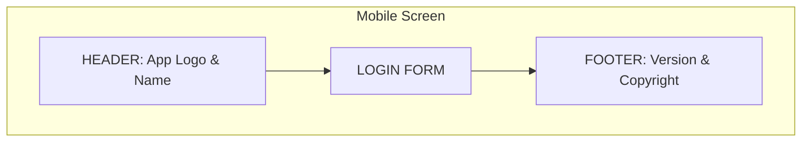
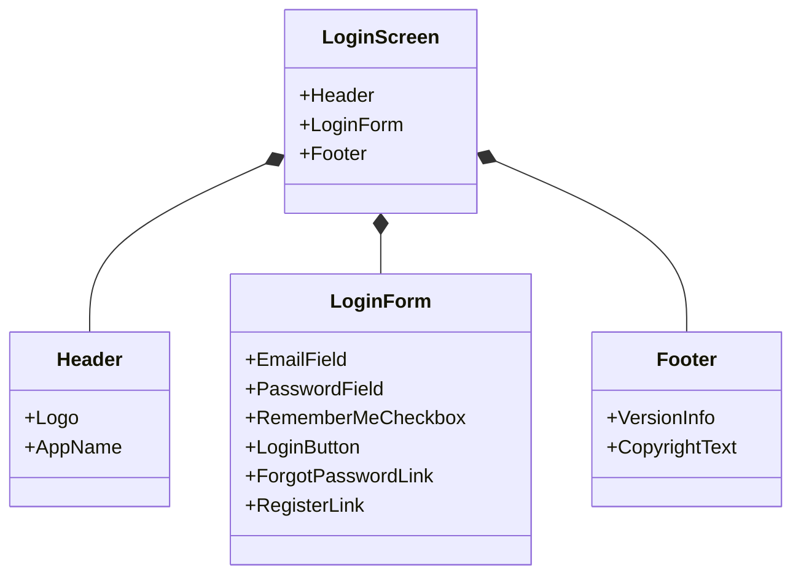

# Login Screen Wireframe

This wireframe illustrates the login screen for the Workforce Automation App.

## Screen Layout

## Detailed Components

## UI Mockup

```mermaid
%%{init: {'theme': 'base', 'themeVariables': { 'primaryColor': '#f4f4f4', 'primaryTextColor': '#333', 'primaryBorderColor': '#ddd', 'lineColor': '#a0a0a0', 'secondaryColor': '#006699', 'tertiaryColor': '#fff'}}}%%
graph TD
    subgraph LoginScreen["Login Screen"]
        subgraph Header["Header"]
            Logo["🔧"]
            AppName["Workforce Automation"]
        end
        
        subgraph Form["Login Form"]
            EmailLabel["Email:"]
            EmailInput["[                    ]"]
            PasswordLabel["Password:"]
            PasswordInput["[                    ]"]
            RememberMe["[✓] Remember me"]
            LoginButton["[ LOGIN ]"]
            ForgotPassword["Forgot password?"]
            RegisterPrompt["Don't have an account?"]
            RegisterLink["Register with company code"]
        end
        
        subgraph Footer["Footer"]
            Version["Version 1.0.0"]
            Copyright["© 2025 Symphonics"]
        end
    end
    
    Logo --- AppName
    EmailLabel --- EmailInput
    PasswordLabel --- PasswordInput
    EmailInput --- PasswordLabel
    PasswordInput --- RememberMe
    RememberMe --- LoginButton
    LoginButton --- ForgotPassword
    ForgotPassword --- RegisterPrompt
    RegisterPrompt --- RegisterLink
    RegisterLink --- Footer
```

## Specifications

### Layout Specifications
- **Screen Size**: Optimized for mobile (375px width)
- **Header Height**: 60px
- **Footer Height**: 40px
- **Form Padding**: 20px on all sides

### Component Specifications

#### Header
- **Logo**: Company logo (SVG format)
- **App Name**: "Workforce Automation" in 18px Roboto Medium

#### Login Form
- **Email Field**:
  - Label: "Email" (14px Roboto Regular)
  - Input: Full width, 44px height, rounded corners (4px)
  - Validation: Email format validation on blur
  - Keyboard: Email type

- **Password Field**:
  - Label: "Password" (14px Roboto Regular)
  - Input: Full width, 44px height, rounded corners (4px)
  - Show/Hide Password toggle icon
  - Keyboard: Password type

- **Remember Me Checkbox**:
  - Label: "Remember me" (14px Roboto Regular)
  - Default: Unchecked

- **Login Button**:
  - Text: "LOGIN" (16px Roboto Medium, uppercase)
  - Full width, 48px height, rounded corners (4px)
  - Background: Primary color (#006699)
  - Text Color: White

- **Forgot Password Link**:
  - Text: "Forgot password?" (14px Roboto Regular)
  - Color: Secondary color (#0099cc)
  - Alignment: Center

- **Register Link**:
  - Text: "Don't have an account? Register with company code" (14px Roboto Regular)
  - Color: Secondary color (#0099cc)
  - Alignment: Center

#### Footer
- **Version**: "Version 1.0.0" (12px Roboto Regular)
- **Copyright**: "© 2025 Symphonics" (12px Roboto Regular)

### Behavior Specifications

1. **Form Validation**:
   - Email field: Required, valid email format
   - Password field: Required, minimum 8 characters
   - Display inline validation errors

2. **Login Button States**:
   - Default: Primary color
   - Hover: Slightly darker shade
   - Pressed: Even darker shade
   - Disabled: Gray (when form is invalid)
   - Loading: Show spinner when authentication is in progress

3. **Error Handling**:
   - Invalid credentials: Display error message below login button
   - Network error: Display connection error with retry option
   - Account locked: Display message with support contact information

4. **Accessibility**:
   - All form elements have proper labels
   - Tab order follows visual layout
   - Error messages are announced to screen readers
   - Color contrast meets WCAG AA standards

## Responsive Behavior

- On larger screens (tablet/desktop), the login form maintains its width (375px) and is centered on screen
- Form elements maintain their size for touch targets
- Keyboard should not obscure the active input field on mobile

## Implementation Notes

1. Use secure storage for "Remember me" functionality
2. Implement proper password hashing and secure transmission
3. Add analytics tracking for login success/failure rates
4. Ensure keyboard navigation works correctly
5. Test on various device sizes and orientations
