# Password Recovery Screen Wireframe

This wireframe illustrates the password recovery flow for the Workforce Automation App.

## Screen Layout

## Detailed Components

## UI Mockup

```mermaid
%%{init: {'theme': 'base', 'themeVariables': { 'primaryColor': '#f4f4f4', 'primaryTextColor': '#333', 'primaryBorderColor': '#ddd', 'lineColor': '#a0a0a0', 'secondaryColor': '#006699', 'tertiaryColor': '#fff'}}}%%
graph TD
    subgraph PasswordRecoveryScreen["Password Recovery Screen"]
        subgraph Header["Header"]
            BackButton["←"]
            Logo["🔧"]
            AppName["Workforce Automation"]
        end
        
        subgraph Form["Password Recovery Form"]
            Title["Reset Password"]
            Instructions["Enter your email address and we'll send you instructions to reset your password."]
            
            EmailLabel["Email:"]
            EmailInput["[                    ]"]
            
            SubmitButton["[ SEND RESET LINK ]"]
            LoginPrompt["Remember your password?"]
            LoginLink["Back to login"]
        end
        
        subgraph Footer["Footer"]
            Version["Version 1.0.0"]
            Copyright["© 2025 Symphonics"]
        end
    end
    
    BackButton --- Logo
    Logo --- AppName
    Title --- Instructions
    Instructions --- EmailLabel
    EmailLabel --- EmailInput
    EmailInput --- SubmitButton
    SubmitButton --- LoginPrompt
    LoginPrompt --- LoginLink
    LoginLink --- Footer
```

## Success Screen

```mermaid
%%{init: {'theme': 'base', 'themeVariables': { 'primaryColor': '#f4f4f4', 'primaryTextColor': '#333', 'primaryBorderColor': '#ddd', 'lineColor': '#a0a0a0', 'secondaryColor': '#006699', 'tertiaryColor': '#fff'}}}%%
graph TD
    subgraph SuccessScreen["Success Screen"]
        subgraph Header["Header"]
            Logo["🔧"]
            AppName["Workforce Automation"]
        end
        
        subgraph Content["Content"]
            SuccessIcon["✓"]
            SuccessTitle["Check Your Email"]
            SuccessMessage["We've sent password reset instructions to your email address. Please check your inbox."]
            
            EmailSentTo["Email sent to: user@example.com"]
            
            NotReceivedPrompt["Didn't receive the email?"]
            ResendLink["Resend email"]
            
            BackToLoginButton["[ BACK TO LOGIN ]"]
        end
        
        subgraph Footer["Footer"]
            Version["Version 1.0.0"]
            Copyright["© 2025 Symphonics"]
        end
    end
    
    Logo --- AppName
    SuccessIcon --- SuccessTitle
    SuccessTitle --- SuccessMessage
    SuccessMessage --- EmailSentTo
    EmailSentTo --- NotReceivedPrompt
    NotReceivedPrompt --- ResendLink
    ResendLink --- BackToLoginButton
    BackToLoginButton --- Footer
```

## Reset Password Screen

```mermaid
%%{init: {'theme': 'base', 'themeVariables': { 'primaryColor': '#f4f4f4', 'primaryTextColor': '#333', 'primaryBorderColor': '#ddd', 'lineColor': '#a0a0a0', 'secondaryColor': '#006699', 'tertiaryColor': '#fff'}}}%%
graph TD
    subgraph ResetPasswordScreen["Reset Password Screen"]
        subgraph Header["Header"]
            Logo["🔧"]
            AppName["Workforce Automation"]
        end
        
        subgraph Form["Reset Password Form"]
            Title["Create New Password"]
            Instructions["Please create a new password for your account."]
            
            PasswordLabel["New Password:"]
            PasswordInput["[                    ]"]
            PasswordRequirements["Password must be at least 8 characters with letters, numbers, and special characters."]
            
            ConfirmPasswordLabel["Confirm Password:"]
            ConfirmPasswordInput["[                    ]"]
            
            ResetButton["[ RESET PASSWORD ]"]
        end
        
        subgraph Footer["Footer"]
            Version["Version 1.0.0"]
            Copyright["© 2025 Symphonics"]
        end
    end
    
    Logo --- AppName
    Title --- Instructions
    Instructions --- PasswordLabel
    PasswordLabel --- PasswordInput
    PasswordInput --- PasswordRequirements
    PasswordRequirements --- ConfirmPasswordLabel
    ConfirmPasswordLabel --- ConfirmPasswordInput
    ConfirmPasswordInput --- ResetButton
    ResetButton --- Footer
```

## Specifications

### Layout Specifications
- **Screen Size**: Optimized for mobile (375px width)
- **Header Height**: 60px
- **Footer Height**: 40px
- **Form Padding**: 20px on all sides

### Component Specifications

#### Header
- **Back Button**: Left-aligned arrow icon (24px)
- **Logo**: Company logo (SVG format)
- **App Name**: "Workforce Automation" in 18px Roboto Medium

#### Password Recovery Form

##### Title
- **Text**: "Reset Password" (20px Roboto Medium)
- **Alignment**: Center
- **Margin**: 24px bottom

##### Instructions
- **Text**: "Enter your email address and we'll send you instructions to reset your password." (14px Roboto Regular)
- **Alignment**: Left
- **Margin**: 16px bottom

##### Email Field
- **Label**: "Email" (14px Roboto Regular)
- **Input**: Full width, 44px height, rounded corners (4px)
- **Validation**: Required, email format
- **Keyboard**: Email type

##### Submit Button
- **Text**: "SEND RESET LINK" (16px Roboto Medium, uppercase)
- **Full width**, 48px height, rounded corners (4px)
- **Background**: Primary color (#006699)
- **Text Color**: White
- **Margin**: 24px top and bottom

##### Login Link
- **Text**: "Remember your password? Back to login" (14px Roboto Regular)
- **Color**: Secondary color (#0099cc) for "Back to login"
- **Alignment**: Center

#### Success Screen

##### Success Icon
- **Icon**: Checkmark in circle (48px)
- **Color**: Success color (#28a745)
- **Alignment**: Center
- **Margin**: 24px bottom

##### Success Title
- **Text**: "Check Your Email" (20px Roboto Medium)
- **Alignment**: Center
- **Margin**: 16px bottom

##### Success Message
- **Text**: "We've sent password reset instructions to your email address. Please check your inbox." (14px Roboto Regular)
- **Alignment**: Center
- **Margin**: 16px bottom

##### Email Sent To
- **Text**: "Email sent to: user@example.com" (14px Roboto Regular)
- **Alignment**: Center
- **Margin**: 24px bottom

##### Resend Link
- **Text**: "Didn't receive the email? Resend email" (14px Roboto Regular)
- **Color**: Secondary color (#0099cc) for "Resend email"
- **Alignment**: Center
- **Margin**: 16px bottom

##### Back to Login Button
- **Text**: "BACK TO LOGIN" (16px Roboto Medium, uppercase)
- **Full width**, 48px height, rounded corners (4px)
- **Background**: Primary color (#006699)
- **Text Color**: White

#### Reset Password Form

##### Title
- **Text**: "Create New Password" (20px Roboto Medium)
- **Alignment**: Center
- **Margin**: 24px bottom

##### Instructions
- **Text**: "Please create a new password for your account." (14px Roboto Regular)
- **Alignment**: Left
- **Margin**: 16px bottom

##### Password Field
- **Label**: "New Password" (14px Roboto Regular)
- **Input**: Full width, 44px height, rounded corners (4px)
- **Show/Hide Password** toggle icon
- **Validation**: Required, minimum 8 characters, letters, numbers, and special characters
- **Requirements Text**: "Password must be at least 8 characters with letters, numbers, and special characters." (12px Roboto Italic)

##### Confirm Password Field
- **Label**: "Confirm Password" (14px Roboto Regular)
- **Input**: Full width, 44px height, rounded corners (4px)
- **Show/Hide Password** toggle icon
- **Validation**: Must match password field

##### Reset Button
- **Text**: "RESET PASSWORD" (16px Roboto Medium, uppercase)
- **Full width**, 48px height, rounded corners (4px)
- **Background**: Primary color (#006699)
- **Text Color**: White
- **Margin**: 24px top

#### Footer
- **Version**: "Version 1.0.0" (12px Roboto Regular)
- **Copyright**: "© 2025 Symphonics" (12px Roboto Regular)

### Behavior Specifications

1. **Form Validation**:
   - Email field: Required, valid email format
   - Password fields: Required, minimum 8 characters, must include letters, numbers, and special characters
   - Confirm password: Must match password field
   - Display inline validation errors

2. **Button States**:
   - Default: Primary color
   - Hover: Slightly darker shade
   - Pressed: Even darker shade
   - Disabled: Gray (when form is invalid)
   - Loading: Show spinner when processing

3. **Error Handling**:
   - Email not found: Display specific error message
   - Invalid token: Display error message with option to request new link
   - Network error: Display connection error with retry option
   - Validation errors: Highlight fields with errors and display messages

4. **Success Handling**:
   - Display success screen after sending reset link
   - Display success message after password reset
   - Redirect to login screen after successful password reset

5. **Accessibility**:
   - All form elements have proper labels
   - Tab order follows visual layout
   - Error messages are announced to screen readers
   - Color contrast meets WCAG AA standards

## User Flow

## Responsive Behavior

- On larger screens (tablet/desktop), the forms maintain their width (375px) and are centered on screen
- Form elements maintain their size for touch targets
- Keyboard should not obscure the active input field on mobile

## Implementation Notes

1. Generate secure, time-limited reset tokens
2. Send reset emails using a reliable email service
3. Implement rate limiting to prevent abuse
4. Log all password reset attempts for security monitoring
5. Ensure password reset links expire after a reasonable time (24 hours)
6. Notify users when their password has been changed
7. Test on various device sizes and orientations
