# Registration Screen Wireframe

This wireframe illustrates the registration screen for the Workforce Automation App, where installers can register using their company code.

## Screen Layout

## Detailed Components

## UI Mockup

```mermaid
%%{init: {'theme': 'base', 'themeVariables': { 'primaryColor': '#f4f4f4', 'primaryTextColor': '#333', 'primaryBorderColor': '#ddd', 'lineColor': '#a0a0a0', 'secondaryColor': '#006699', 'tertiaryColor': '#fff'}}}%%
graph TD
    subgraph RegistrationScreen["Registration Screen"]
        subgraph Header["Header"]
            BackButton["←"]
            Logo["🔧"]
            AppName["Workforce Automation"]
        end
        
        subgraph Form["Registration Form"]
            Title["Create Account"]
            
            subgraph PersonalInfo["Personal Information"]
                FirstNameLabel["First Name:"]
                FirstNameInput["[                    ]"]
                LastNameLabel["Last Name:"]
                LastNameInput["[                    ]"]
                EmailLabel["Email:"]
                EmailInput["[                    ]"]
                PhoneLabel["Phone:"]
                PhoneInput["[                    ]"]
            end
            
            subgraph CompanyCode["Company Information"]
                CompanyCodeLabel["Company Code:"]
                CompanyCodeInput["[                    ]"]
                CompanyCodeInfo["ℹ️ Provided by your company administrator"]
            end
            
            subgraph Terms["Terms & Conditions"]
                TermsCheckbox["[ ] I agree to the"]
                TermsLink["Terms of Service"]
                AndText["and"]
                PrivacyLink["Privacy Policy"]
            end
            
            RegisterButton["[ REGISTER ]"]
            LoginPrompt["Already have an account?"]
            LoginLink["Log in"]
        end
        
        subgraph Footer["Footer"]
            Version["Version 1.0.0"]
            Copyright["© 2025 Symphonics"]
        end
    end
    
    BackButton --- Logo
    Logo --- AppName
    Title --- PersonalInfo
    FirstNameLabel --- FirstNameInput
    FirstNameInput --- LastNameLabel
    LastNameLabel --- LastNameInput
    LastNameInput --- EmailLabel
    EmailLabel --- EmailInput
    EmailInput --- PhoneLabel
    PhoneLabel --- PhoneInput
    PhoneInput --- CompanyCode
    CompanyCodeLabel --- CompanyCodeInput
    CompanyCodeInput --- CompanyCodeInfo
    CompanyCodeInfo --- Terms
    TermsCheckbox --- TermsLink
    TermsLink --- AndText
    AndText --- PrivacyLink
    PrivacyLink --- RegisterButton
    RegisterButton --- LoginPrompt
    LoginPrompt --- LoginLink
    LoginLink --- Footer
```

## Specifications

### Layout Specifications
- **Screen Size**: Optimized for mobile (375px width)
- **Header Height**: 60px
- **Footer Height**: 40px
- **Form Padding**: 20px on all sides
- **Section Spacing**: 24px between sections

### Component Specifications

#### Header
- **Back Button**: Left-aligned arrow icon (24px)
- **Logo**: Company logo (SVG format)
- **App Name**: "Workforce Automation" in 18px Roboto Medium

#### Registration Form

##### Title
- **Text**: "Create Account" (20px Roboto Medium)
- **Alignment**: Center
- **Margin**: 24px bottom

##### Personal Information Section
- **First Name Field**:
  - Label: "First Name" (14px Roboto Regular)
  - Input: Full width, 44px height, rounded corners (4px)
  - Validation: Required, letters only
  - Keyboard: Text type with auto-capitalization

- **Last Name Field**:
  - Label: "Last Name" (14px Roboto Regular)
  - Input: Full width, 44px height, rounded corners (4px)
  - Validation: Required, letters only
  - Keyboard: Text type with auto-capitalization

- **Email Field**:
  - Label: "Email" (14px Roboto Regular)
  - Input: Full width, 44px height, rounded corners (4px)
  - Validation: Required, email format
  - Keyboard: Email type

- **Phone Field**:
  - Label: "Phone" (14px Roboto Regular)
  - Input: Full width, 44px height, rounded corners (4px)
  - Validation: Required, phone format
  - Keyboard: Phone type
  - Formatting: Automatic formatting as user types

##### Company Code Section
- **Company Code Field**:
  - Label: "Company Code" (14px Roboto Regular)
  - Input: Full width, 44px height, rounded corners (4px)
  - Validation: Required, alphanumeric format
  - Info Text: "Provided by your company administrator" (12px Roboto Italic)

##### Terms Section
- **Terms Checkbox**:
  - Label: "I agree to the" (14px Roboto Regular)
  - Default: Unchecked
  - Validation: Must be checked to register

- **Terms Links**:
  - "Terms of Service" and "Privacy Policy" (14px Roboto Medium)
  - Color: Secondary color (#0099cc)
  - Action: Opens modal with respective content

- **Register Button**:
  - Text: "REGISTER" (16px Roboto Medium, uppercase)
  - Full width, 48px height, rounded corners (4px)
  - Background: Primary color (#006699)
  - Text Color: White
  - Margin: 24px top and bottom

- **Login Link**:
  - Text: "Already have an account? Log in" (14px Roboto Regular)
  - Color: Secondary color (#0099cc) for "Log in"
  - Alignment: Center

#### Footer
- **Version**: "Version 1.0.0" (12px Roboto Regular)
- **Copyright**: "© 2025 Symphonics" (12px Roboto Regular)

### Behavior Specifications

1. **Form Validation**:
   - All fields are required
   - Email must be a valid format and not already registered
   - Phone must be a valid format
   - Company code must be valid and active
   - Terms checkbox must be checked
   - Display inline validation errors

2. **Register Button States**:
   - Default: Primary color
   - Hover: Slightly darker shade
   - Pressed: Even darker shade
   - Disabled: Gray (when form is invalid)
   - Loading: Show spinner when registration is in progress

3. **Error Handling**:
   - Invalid company code: Display specific error message
   - Email already registered: Suggest login instead
   - Network error: Display connection error with retry option
   - Validation errors: Highlight fields with errors and display messages

4. **Success Handling**:
   - Display success message
   - Inform user about pending approval process
   - Provide option to go to login screen

5. **Accessibility**:
   - All form elements have proper labels
   - Tab order follows visual layout
   - Error messages are announced to screen readers
   - Color contrast meets WCAG AA standards

## Responsive Behavior

- On larger screens (tablet/desktop), the registration form maintains its width (375px) and is centered on screen
- Form elements maintain their size for touch targets
- Keyboard should not obscure the active input field on mobile
- Scrollable content with fixed header and footer

## Implementation Notes

1. Validate company code in real-time against the API
2. Implement proper password security measures
3. Add analytics tracking for registration success/failure rates
4. Store registration data securely
5. Implement rate limiting to prevent abuse
6. Test on various device sizes and orientations
