# Intervention List Screen Wireframe

This wireframe illustrates the intervention list screen for the Workforce Automation App, which provides a filterable, searchable list of all interventions assigned to the installer.

## Screen Layout

## Detailed Components

## UI Mockup

```mermaid
%%{init: {'theme': 'base', 'themeVariables': { 'primaryColor': '#f4f4f4', 'primaryTextColor': '#333', 'primaryBorderColor': '#ddd', 'lineColor': '#a0a0a0', 'secondaryColor': '#006699', 'tertiaryColor': '#fff'}}}%%
graph TD
    subgraph InterventionListScreen["Intervention List Screen"]
        subgraph Header["Header"]
            Title["Interventions"]
            SearchButton["🔍"]
            FilterButton["⚙️"]
        end
        
        subgraph FilterControls["Filter Controls"]
            subgraph StatusTabs["Status Tabs"]
                TabAll["All"]
                TabPending["Pending"]
                TabInProgress["In Progress"]
                TabCompleted["Completed"]
            end
            
            subgraph DateFilter["Date Filter"]
                DateLabel["Date:"]
                DateValue["All Time ▼"]
            end
            
            subgraph SortOptions["Sort Options"]
                SortLabel["Sort:"]
                SortValue["Date (Newest) ▼"]
            end
        end
        
        subgraph InterventionList["Intervention List"]
            subgraph Card1["Intervention Card"]
                Card1Name["Thomas Martin"]
                Card1Address["45 Rue des Fleurs, 75015 Paris"]
                Card1Status["En_cours"]
                Card1Date["Today, 14:30"]
                Card1Icons["🔧"]
                Card1Actions["View →"]
            end
            
            subgraph Card2["Intervention Card"]
                Card2Name["Marie Dubois"]
                Card2Address["12 Avenue Victor Hugo, 75016 Paris"]
                Card2Status["A_traiter"]
                Card2Date["Tomorrow, 10:00"]
                Card2Icons["🔧"]
                Card2Actions["View →"]
            end
            
            subgraph Card3["Intervention Card"]
                Card3Name["Jean Dupont"]
                Card3Address["8 Rue de Rivoli, 75004 Paris"]
                Card3Status["quote_sent"]
                Card3Date["Yesterday, 16:45"]
                Card3Icons["🔧"]
                Card3Actions["View →"]
            end
            
            LoadMore["Load more..."]
        end
        
        FAB["+"]
        
        subgraph NavBar["Navigation Bar"]
            HomeIcon["🏠"]
            CalendarIcon["📅"]
            ProfileIcon["👤"]
            SettingsIcon["⚙️"]
        end
    end
    
    Title --- SearchButton
    SearchButton --- FilterButton
    
    TabAll --- TabPending
    TabPending --- TabInProgress
    TabInProgress --- TabCompleted
    
    DateLabel --- DateValue
    SortLabel --- SortValue
    
    Card1 --- Card2
    Card2 --- Card3
    Card3 --- LoadMore
    
    HomeIcon --- CalendarIcon
    CalendarIcon --- ProfileIcon
    ProfileIcon --- SettingsIcon
```

## Empty State

```mermaid
%%{init: {'theme': 'base', 'themeVariables': { 'primaryColor': '#f4f4f4', 'primaryTextColor': '#333', 'primaryBorderColor': '#ddd', 'lineColor': '#a0a0a0', 'secondaryColor': '#006699', 'tertiaryColor': '#fff'}}}%%
graph TD
    subgraph EmptyState["Empty State"]
        EmptyIcon["📋"]
        EmptyTitle["No Interventions Found"]
        EmptyMessage["There are no interventions matching your current filters."]
        EmptyAction["[ CLEAR FILTERS ]"]
    end
    
    EmptyIcon --- EmptyTitle
    EmptyTitle --- EmptyMessage
    EmptyMessage --- EmptyAction
```

## Specifications

### Layout Specifications
- **Screen Size**: Optimized for mobile (375px width)
- **Header Height**: 60px
- **Filter Controls Height**: 100px
- **Card Height**: 100px
- **Navigation Bar Height**: 60px
- **Floating Action Button**: 56px diameter

### Component Specifications

#### Header
- **Title**: "Interventions" (20px Roboto Medium)
- **Search Button**: Magnifying glass icon (24px)
- **Filter Button**: Filter/settings icon (24px)

#### Filter Controls

##### Status Tabs
- **Container**: Full width, horizontal scrollable area
- **Tabs**: Equal width if they fit, otherwise scrollable
  - Active tab: Primary color underline, bold text
  - Inactive tab: No underline, regular text
- **Tab Options**:
  - All
  - Pending (A_traiter)
  - In Progress (En_cours, quote_sent, quote_signed, invoice_sent)
  - Completed (installation_done, published)

##### Date Filter
- **Label**: "Date:" (14px Roboto Regular)
- **Value**: Dropdown with options (14px Roboto Medium)
  - All Time
  - Today
  - This Week
  - This Month
  - Custom Range...

##### Sort Options
- **Label**: "Sort:" (14px Roboto Regular)
- **Value**: Dropdown with options (14px Roboto Medium)
  - Date (Newest)
  - Date (Oldest)
  - Customer Name (A-Z)
  - Status

#### Intervention List
- **Container**: Full width, scrollable area
- **Intervention Cards**: Full width, rounded corners (8px), white background, subtle shadow

##### Intervention Card
- **Customer Name**: Bold text (16px Roboto Medium)
- **Address**: Regular text (14px Roboto Regular)
- **Status**: Pill with status-specific color (12px Roboto Medium)
  - A_traiter: Orange (#FFA500)
  - En_cours: Blue (#1E90FF)
  - quote_sent: Purple (#9370DB)
  - quote_signed: Teal (#008080)
  - invoice_sent: Pink (#FF69B4)
  - installation_done: Green (#28a745)
  - published: Dark Green (#006400)
  - canceled: Red (#DC3545)
- **Date**: Gray text (12px Roboto Regular)
- **Operation Icons**: Small icons representing operation types (16px)
- **Action Button**: "View →" text with arrow (14px Roboto Medium)
- **Tap Action**: Navigate to intervention details

##### Empty State
- **Icon**: Clipboard or document icon (48px)
- **Title**: "No Interventions Found" (18px Roboto Medium)
- **Message**: Descriptive text explaining why no interventions are shown (14px Roboto Regular)
- **Action Button**: "CLEAR FILTERS" button if filters are applied (16px Roboto Medium)

##### Loading State
- **Skeleton Cards**: Animated placeholder cards
- **Loading Indicator**: Subtle spinner or progress bar

##### Load More Button
- **Text**: "Load more..." (14px Roboto Regular)
- **Action**: Load next page of interventions
- **States**: Loading spinner when fetching more data

#### Floating Action Button (FAB)
- **Size**: 56px diameter
- **Icon**: Plus sign (24px)
- **Color**: Primary color (#006699)
- **Position**: Bottom right, 16px margin from edges
- **Elevation**: Subtle shadow for depth
- **Action**: Create new intervention

#### Navigation Bar
- **Container**: Full width, fixed at bottom, white background, subtle top shadow
- **Icons**: Home, Calendar, Profile, Settings (24px each)
- **Active Icon**: Primary color (#006699)
- **Inactive Icon**: Gray (#757575)
- **Labels**: Optional small text labels below icons (10px Roboto Regular)

### Behavior Specifications

1. **Header**:
   - Search button: Expands to search input when tapped
   - Filter button: Opens advanced filter modal

2. **Filter Controls**:
   - Status tabs: Single selection, updates list immediately
   - Date filter: Opens dropdown with date range options
   - Sort options: Opens dropdown with sorting options
   - All filters persist between sessions

3. **Intervention List**:
   - Vertical scrolling for the list
   - Pull-to-refresh functionality
   - Load more button appears when more items are available
   - Cards are sorted according to selected sort option
   - Swipe actions:
     - Swipe right: Quick status change
     - Swipe left: Quick actions menu (view, edit, etc.)

4. **Empty State**:
   - Displays when no interventions match current filters
   - Clear filters button resets all filters to default

5. **Floating Action Button**:
   - Tap to create new intervention
   - Scrolls with content but remains visible

6. **Navigation Bar**:
   - Fixed at bottom of screen
   - Highlights current active section
   - Provides haptic feedback on tap

7. **Advanced Filtering**:
   - Modal with additional filter options:
     - Customer name
     - Address/location
     - Operation type
     - Custom date range picker

8. **Search Functionality**:
   - Real-time filtering as user types
   - Searches across customer name, address, and intervention ID
   - Recent searches are saved
   - Voice input option on supported devices

### Responsive Behavior

- On larger screens (tablet):
  - Two-column layout for intervention cards
  - Persistent search field in header
  - Expanded filter controls with more visible options

- On desktop:
  - Three-column layout for intervention cards
  - Side navigation instead of bottom navigation
  - Advanced filtering panel can be pinned open

### Accessibility Considerations

1. **Color Contrast**:
   - All text meets WCAG AA standards for contrast
   - Status colors have text alternatives

2. **Touch Targets**:
   - All interactive elements are at least 44x44px
   - Adequate spacing between touch targets

3. **Screen Readers**:
   - All elements have appropriate labels
   - Status changes are announced
   - Navigation elements have clear roles

4. **Keyboard Navigation**:
   - Logical tab order
   - Focus indicators for all interactive elements

## Implementation Notes

1. Use skeleton screens during loading for better perceived performance
2. Implement efficient list rendering for smooth scrolling with large datasets
3. Cache filter preferences in local storage
4. Use appropriate animations for transitions and interactions
5. Ensure all interactive elements have appropriate feedback states
6. Implement proper error handling for failed data loading
7. Consider implementing virtual scrolling for very large lists
