# Commission Reports Wireframe

This wireframe illustrates the commission reports screen for the Workforce Automation App, which provides administrators, managers, and finance teams with detailed information about commissions earned by companies and installers based on completed interventions.

## Screen Layout

## Detailed Components

## UI Mockup - Commission Reports Overview

```mermaid
%%{init: {'theme': 'base', 'themeVariables': { 'primaryColor': '#f4f4f4', 'primaryTextColor': '#333', 'primaryBorderColor': '#ddd', 'lineColor': '#a0a0a0', 'secondaryColor': '#006699', 'tertiaryColor': '#fff'}}}%%
graph TD
    subgraph CommissionReportsScreen["Commission Reports Screen"]
        subgraph Sidebar["Sidebar Navigation"]
            Logo["🔧"]
            NavDashboard["Dashboard"]
            NavCompanies["Companies"]
            NavUsers["Users"]
            NavInterventions["Interventions"]
            NavReports["Reports"]
            NavSettings["Settings"]
        end
        
        subgraph Header["Header"]
            Title["Commission Reports"]
            ExportButton["[ EXPORT ▼ ]"]
            PrintButton["[ PRINT ]"]
            RefreshButton["[ REFRESH ]"]
            AdminInfo["Admin User ▼"]
        end
        
        subgraph Filters["Filters & Date Range"]
            DateRange["Period: Q1 2025 (Jan-Mar) ▼"]
            CompanyFilter["Company: All ▼"]
            RegionFilter["Region: All ▼"]
            StatusFilter["Payment Status: All ▼"]
            OperationFilter["Operation Type: All ▼"]
            ApplyButton["[ APPLY ]"]
        end
        
        subgraph Summary["Commission Summary"]
            subgraph TotalCommission["Total Commission"]
                TotalValue["€245,780"]
                TotalChange["+15% vs. previous period"]
            end
            
            subgraph PendingCommission["Pending Commission"]
                PendingValue["€78,450"]
                PendingChange["+8% vs. previous period"]
            end
            
            subgraph PaidCommission["Paid Commission"]
                PaidValue["€167,330"]
                PaidChange["+18% vs. previous period"]
            end
            
            subgraph AverageCommission["Avg. Commission"]
                AvgValue["€198 per intervention"]
                AvgChange["+5% vs. previous period"]
            end
        end
        
        subgraph Charts["Charts & Visualizations"]
            subgraph TrendChart["Commission Trend"]
                TrendGraph["[Line Chart: Commission over time]"]
                TrendControls["Monthly | Quarterly | Yearly"]
            end
            
            subgraph CompanyChart["Commission by Company"]
                CompanyGraph["[Bar Chart: Top 5 Companies by Commission]"]
                CompanyTotal["Total: €245,780"]
            end
            
            subgraph OperationChart["Commission by Operation Type"]
                OperationGraph["[Pie Chart: Commission by Operation Type]"]
                OperationLegend["BAR-TH-173: 35% | BAR-TH-171: 25% | BAR-TH-104: 20% | Others: 20%"]
            end
            
            subgraph StatusChart["Payment Status"]
                StatusGraph["[Donut Chart: Paid vs. Pending]"]
                StatusLegend["Paid: 68% | Pending: 32%"]
            end
        end
        
        subgraph CommissionTable["Commission Details"]
            TableTitle["Commission Details"]
            
            subgraph TableHeader["Table Header"]
                HeaderCheckbox["[ ]"]
                HeaderCompany["Company ▼"]
                HeaderInterventions["Interventions"]
                HeaderOperations["Operation Types"]
                HeaderAmount["Commission Amount ▼"]
                HeaderStatus["Payment Status"]
                HeaderDate["Last Updated"]
                HeaderActions["Actions"]
            end
            
            subgraph Row1["Table Row"]
                Row1Checkbox["[ ]"]
                Row1Company["Électricité Plus"]
                Row1Interventions["243"]
                Row1Operations["BAR-TH-173, BAR-TH-171"]
                Row1Amount["€48,250"]
                Row1Status["Partially Paid"]
                Row1Date["Mar 15, 2025"]
                Row1Actions["[ VIEW ] [ EXPORT ]"]
            end
            
            subgraph Row2["Table Row"]
                Row2Checkbox["[ ]"]
                Row2Company["Chauffage Expert"]
                Row2Interventions["187"]
                Row2Operations["BAR-TH-104, BAR-TH-106"]
                Row2Amount["€42,780"]
                Row2Status["Paid"]
                Row2Date["Mar 10, 2025"]
                Row2Actions["[ VIEW ] [ EXPORT ]"]
            end
            
            subgraph Row3["Table Row"]
                Row3Checkbox["[ ]"]
                Row3Company["Isolation Pro"]
                Row3Interventions["156"]
                Row3Operations["BAR-TH-173, BAR-EQ-115"]
                Row3Amount["€35,450"]
                Row3Status["Pending"]
                Row3Date["Mar 20, 2025"]
                Row3Actions["[ VIEW ] [ EXPORT ]"]
            end
            
            subgraph TableFooter["Table Footer"]
                BatchActions["With selected: [ MARK AS PAID ] [ EXPORT ]"]
                Pagination["< 1 2 3 ... 10 >"]
                ItemsPerPage["Items per page: 10 ▼"]
            end
        end
    end
    
    NavDashboard --- NavCompanies
    NavCompanies --- NavUsers
    NavUsers --- NavInterventions
    NavInterventions --- NavReports
    NavReports --- NavSettings
    
    Title --- ExportButton
    ExportButton --- PrintButton
    PrintButton --- RefreshButton
    RefreshButton --- AdminInfo
    
    DateRange --- CompanyFilter
    CompanyFilter --- RegionFilter
    RegionFilter --- StatusFilter
    StatusFilter --- OperationFilter
    OperationFilter --- ApplyButton
    
    TotalCommission --- PendingCommission
    PendingCommission --- PaidCommission
    PaidCommission --- AverageCommission
    
    TrendChart --- CompanyChart
    CompanyChart --- OperationChart
    OperationChart --- StatusChart
    
    TableTitle --- TableHeader
    TableHeader --- Row1
    Row1 --- Row2
    Row2 --- Row3
    Row3 --- TableFooter
    
    BatchActions --- Pagination
    Pagination --- ItemsPerPage
```

## UI Mockup - Company Commission Detail

## UI Mockup - Payment Processing Modal

```mermaid
%%{init: {'theme': 'base', 'themeVariables': { 'primaryColor': '#f4f4f4', 'primaryTextColor': '#333', 'primaryBorderColor': '#ddd', 'lineColor': '#a0a0a0', 'secondaryColor': '#006699', 'tertiaryColor': '#fff'}}}%%
graph TD
    subgraph PaymentModal["Payment Processing Modal"]
        subgraph PaymentHeader["Payment Header"]
            PaymentTitle["Process Commission Payment"]
            PaymentClose["×"]
        end
        
        subgraph PaymentDetails["Payment Details"]
            PaymentCompany["Company: Électricité Plus"]
            PaymentAmount["Amount: €16,100"]
            PaymentPeriod["Period: Q1 2025 (Jan-Mar)"]
            PaymentDate["Payment Date: Apr 15, 2025"]
        end
        
        subgraph PaymentMethod["Payment Method"]
            MethodLabel["Payment Method:"]
            MethodSelect["Bank Transfer ▼"]
            ReferenceLabel["Reference:"]
            ReferenceInput["PAY-2025-0415"]
            NotesLabel["Payment Notes:"]
            NotesInput["Commission payment for Q1 2025"]
        end
        
        subgraph PaymentOptions["Payment Options"]
            GenerateInvoiceCheck["[✓] Generate invoice"]
            SendNotificationCheck["[✓] Send notification to company"]
            MarkInterventionsCheck["[✓] Mark related interventions as paid"]
        end
        
        subgraph PaymentActions["Actions"]
            ProcessButton["[ PROCESS PAYMENT ]"]
            ScheduleButton["[ SCHEDULE PAYMENT ]"]
            CancelPaymentButton["[ CANCEL ]"]
        end
    end
    
    PaymentTitle --- PaymentClose
    
    PaymentCompany --- PaymentAmount
    PaymentAmount --- PaymentPeriod
    PaymentPeriod --- PaymentDate
    
    MethodLabel --- MethodSelect
    MethodSelect --- ReferenceLabel
    ReferenceLabel --- ReferenceInput
    ReferenceInput --- NotesLabel
    NotesLabel --- NotesInput
    
    GenerateInvoiceCheck --- SendNotificationCheck
    SendNotificationCheck --- MarkInterventionsCheck
    
    ProcessButton --- ScheduleButton
    ScheduleButton --- CancelPaymentButton
```

## Specifications

### Layout Specifications
- **Screen Size**: Optimized for desktop (responsive down to tablet)
- **Sidebar Width**: 240px (collapsible to 64px)
- **Header Height**: 64px
- **Filters Height**: 60px
- **Summary Section Height**: 120px
- **Chart Section Height**: Flexible, approximately 400px
- **Table Section Height**: Flexible, approximately 400px

### Component Specifications

#### Sidebar
- **Logo**: Company logo (SVG format, 32px)
- **Navigation Items**: 
  - Dashboard
  - Companies
  - Users
  - Interventions
  - Reports (active)
  - Settings
- **Active Item**: Primary color background (#006699), white text
- **Inactive Items**: Gray text (#333333)
- **Collapse Button**: Arrow icon to collapse/expand sidebar

#### Header
- **Title**: "Commission Reports" (24px Roboto Medium)
- **Export Button**: "EXPORT" (14px Roboto Medium)
  - White background, primary color border and text
  - Dropdown with format options (PDF, Excel, CSV)
- **Print Button**: "PRINT" (14px Roboto Medium)
  - White background, primary color border and text
- **Refresh Button**: "REFRESH" (14px Roboto Medium)
  - White background, primary color border and text
  - Shows last refresh time on hover
- **User Info**: Username with dropdown for profile actions

#### Filters
- **Date Range Picker**: Dropdown with preset ranges and custom option
  - This Month, Last Month, This Quarter, Last Quarter, This Year, Last Year, Custom
- **Company Filter**: Dropdown with companies
- **Region Filter**: Dropdown with regions
- **Status Filter**: Dropdown with payment statuses (All, Paid, Partially Paid, Pending)
- **Operation Type Filter**: Dropdown with operation types
- **Apply Button**: "APPLY" button to apply selected filters

#### Commission Summary
- **Summary Cards**: Four cards showing key metrics
  - Total Commission: Amount with trend indicator
  - Pending Commission: Amount with trend indicator
  - Paid Commission: Amount with trend indicator
  - Average Commission: Amount per intervention with trend indicator
- **Card Design**:
  - White background, subtle shadow
  - Large value (24px Roboto Medium)
  - Trend indicator with color (green for positive, red for negative)
  - Comparison with previous period

#### Charts Section
- **Commission Trend**: Line chart showing commission over time
  - Multiple series (total, paid, pending)
  - Time grouping options (monthly, quarterly, yearly)
- **Commission by Company**: Bar chart showing top companies by commission
  - Sortable by different metrics
  - Comparison with average
- **Commission by Operation Type**: Pie chart showing commission breakdown by operation type
  - Color-coded by operation type
  - Legend with amounts and percentages
- **Payment Status**: Donut chart showing paid vs. pending commission
  - Color-coded by status
  - Legend with amounts and percentages

#### Commission Table
- **Table Header**: Column headers with sort indicators
  - Checkbox for bulk selection
  - Company (sortable)
  - Interventions count
  - Operation Types
  - Commission Amount (sortable)
  - Payment Status
  - Last Updated (sortable)
  - Actions
- **Table Row**: Data row with commission information
  - Alternating row background for better readability
  - Hover state with light highlight
- **Status Indicator**:
  - Paid: Green pill
  - Partially Paid: Orange pill
  - Pending: Gray pill
- **Action Buttons**: "VIEW" and "EXPORT" text buttons
- **Batch Actions**: Actions for selected rows (Mark as Paid, Export)
- **Pagination**: Page navigation with items per page selector

### Behavior Specifications

1. **Commission Overview**:
   - All metrics and charts update based on selected filters
   - Summary shows comparison with previous equivalent period
   - Charts are interactive with hover tooltips
   - Click on chart elements to drill down for more details

2. **Filtering**:
   - Date range selection affects all metrics and charts
   - Company, region, status, and operation filters can be combined
   - Apply button updates all components
   - Clear filters option available

3. **Commission Table**:
   - Sortable columns for flexible data analysis
   - Checkbox selection for bulk actions
   - View button opens detailed view for specific company
   - Export button generates company-specific report

4. **Company Detail View**:
   - Shows comprehensive information about company commissions
   - Detailed breakdown by intervention and operation
   - Payment history with status
   - Actions for payment processing and reporting

5. **Payment Processing**:
   - Mark as Paid button opens payment processing modal
   - Options for payment method and reference
   - Generate invoice option
   - Schedule payment for future date

6. **Export Options**:
   - Export entire report or specific company details
   - Format options include PDF, Excel, and CSV
   - Option to include or exclude specific sections
   - Email report directly to stakeholders

### Detailed Views

1. **Company Commission Detail**:
   - Company information and summary
   - Commission trend over time
   - Breakdown by operation type
   - List of contributing interventions
   - Payment history
   - Payment processing actions

2. **Payment Processing Modal**:
   - Payment details (company, amount, period)
   - Payment method selection
   - Reference and notes fields
   - Options for invoice generation and notifications
   - Process or schedule payment actions

3. **Invoice Preview**:
   - Generated invoice preview
   - Company and payment details
   - Itemized list of interventions
   - Payment terms and instructions
   - Download and send options

### Responsive Behavior

- On smaller desktop screens:
  - Sidebar collapses to icons only
  - Charts resize proportionally
  - Summary cards maintain size but rearrange if needed

- On tablet:
  - Sidebar becomes a hamburger menu
  - Charts stack vertically
  - Summary cards stack in 2x2 grid
  - Table becomes scrollable horizontally

### Accessibility Considerations

1. **Color Contrast**:
   - All text meets WCAG AA standards for contrast
   - Charts use colorblind-friendly palettes
   - Alternative text representations for all visual data

2. **Keyboard Navigation**:
   - Logical tab order
   - Focus indicators for all interactive elements
   - Keyboard shortcuts for common actions

3. **Screen Readers**:
   - All charts have appropriate ARIA labels
   - Data tables have proper headers and structure
   - Summary text alternatives for complex visualizations

### Data Management

1. **Data Loading**:
   - Progressive loading for large datasets
   - Skeleton screens during initial load
   - Cached data for recently viewed reports

2. **Data Export**:
   - Multiple format options (PDF, Excel, CSV)
   - Configurable export settings
   - Option to schedule recurring reports
   - Email delivery options

3. **Data Freshness**:
   - Clear indication of data freshness (last updated time)
   - Option to set automatic refresh intervals
   - Cache invalidation on data updates

## Implementation Notes

1. Use a responsive dashboard framework for layout
2. Implement efficient data visualization libraries
3. Use data caching for improved performance
4. Implement proper error handling for data loading failures
5. Use appropriate loading states for asynchronous operations
6. Ensure all charts have proper legends and tooltips
7. Implement proper validation for payment processing
8. Use secure methods for financial data handling
9. Implement audit logging for all payment actions
10. Ensure proper authorization checks for financial operations
