# Status Dashboard Wireframe

This wireframe illustrates the status dashboard screen for the Workforce Automation App, which provides administrators and managers with a comprehensive overview of intervention statuses, key metrics, and performance indicators.

## Screen Layout

## Detailed Components

## UI Mockup - Dashboard Overview

## UI Mockup - Status Distribution Detail

```mermaid
%%{init: {'theme': 'base', 'themeVariables': { 'primaryColor': '#f4f4f4', 'primaryTextColor': '#333', 'primaryBorderColor': '#ddd', 'lineColor': '#a0a0a0', 'secondaryColor': '#006699', 'tertiaryColor': '#fff'}}}%%
graph TD
    subgraph StatusDetailView["Status Distribution Detail View"]
        subgraph DetailHeader["Detail Header"]
            DetailTitle["Status Distribution"]
            DetailDateRange["Period: Last 30 Days"]
            DetailClose["×"]
        end
        
        subgraph ChartSection["Chart Section"]
            DetailChart["[Detailed Pie Chart with Percentages]"]
            
            subgraph Legend["Status Legend"]
                Legend1["■ A_traiter: 187 (15%)"]
                Legend2["■ En_cours: 311 (25%)"]
                Legend3["■ quote_sent: 125 (10%)"]
                Legend4["■ quote_signed: 62 (5%)"]
                Legend5["■ invoice_sent: 125 (10%)"]
                Legend6["■ installation_done: 187 (15%)"]
                Legend7["■ published: 187 (15%)"]
                Legend8["■ canceled: 62 (5%)"]
            end
        end
        
        subgraph MetricsSection["Metrics Section"]
            subgraph Metric1["Average Time in Status"]
                Metric1Title["Average Time in Status"]
                Metric1Chart["[Bar Chart: Avg. Days per Status]"]
            end
            
            subgraph Metric2["Status Transition"]
                Metric2Title["Status Transition Flows"]
                Metric2Chart["[Sankey Diagram: Status Transitions]"]
            end
        end
        
        subgraph TableSection["Table Section"]
            DetailTableTitle["Status Details"]
            DetailTableHeader["Status | Count | % | Avg. Time | Trend | Actions"]
            
            subgraph Row1["Table Row"]
                Row1Status["A_traiter"]
                Row1Count["187"]
                Row1Percent["15%"]
                Row1Time["1.2 days"]
                Row1Trend["↑ 5%"]
                Row1Actions["[ VIEW ]"]
            end
            
            subgraph Row2["Table Row"]
                Row2Status["En_cours"]
                Row2Count["311"]
                Row2Percent["25%"]
                Row2Time["2.5 days"]
                Row2Trend["↓ 3%"]
                Row2Actions["[ VIEW ]"]
            end
            
            subgraph Row3["Table Row"]
                Row3Status["published"]
                Row3Count["187"]
                Row3Percent["15%"]
                Row3Time["N/A"]
                Row3Trend["↑ 10%"]
                Row3Actions["[ VIEW ]"]
            end
        end
    end
    
    DetailTitle --- DetailDateRange
    DetailDateRange --- DetailClose
    
    DetailChart --- Legend
    
    Legend1 --- Legend2
    Legend2 --- Legend3
    Legend3 --- Legend4
    Legend4 --- Legend5
    Legend5 --- Legend6
    Legend6 --- Legend7
    Legend7 --- Legend8
    
    Metric1 --- Metric2
    
    DetailTableTitle --- DetailTableHeader
    DetailTableHeader --- Row1
    Row1 --- Row2
    Row2 --- Row3
```

## UI Mockup - Timeline Chart Detail

```mermaid
%%{init: {'theme': 'base', 'themeVariables': { 'primaryColor': '#f4f4f4', 'primaryTextColor': '#333', 'primaryBorderColor': '#ddd', 'lineColor': '#a0a0a0', 'secondaryColor': '#006699', 'tertiaryColor': '#fff'}}}%%
graph TD
    subgraph TimelineDetailView["Timeline Detail View"]
        subgraph TimelineHeader["Timeline Header"]
            TimelineTitle["Interventions Timeline"]
            TimelineDateRange["Period: Last 30 Days"]
            TimelineClose["×"]
        end
        
        subgraph ChartControls["Chart Controls"]
            GroupingOptions["Group By: Day | Week | Month"]
            MetricOptions["Metric: Count | Completion Rate | Avg. Time"]
            ComparisonToggle["Compare with Previous Period [✓]"]
        end
        
        subgraph MainChart["Main Chart"]
            LineChart["[Detailed Line Chart with Multiple Series]"]
            
            subgraph LineLegend["Chart Legend"]
                Line1["— Total Interventions"]
                Line2["— New Interventions"]
                Line3["— Completed Interventions"]
                Line4["— Published Interventions"]
                Line5["- - Previous Period"]
            end
        end
        
        subgraph BreakdownSection["Breakdown Section"]
            subgraph Breakdown1["Status Breakdown"]
                Breakdown1Title["Status Breakdown Over Time"]
                Breakdown1Chart["[Stacked Area Chart: Status Distribution]"]
            end
            
            subgraph Breakdown2["Regional Breakdown"]
                Breakdown2Title["Regional Breakdown Over Time"]
                Breakdown2Chart["[Grouped Bar Chart: Top 5 Regions]"]
            end
        end
        
        subgraph DataTable["Data Table"]
            DataTableTitle["Timeline Data"]
            DataTableHeader["Date | New | In Progress | Completed | Published | Total"]
            
            subgraph DataRow1["Table Row"]
                DataRow1Date["Mar 22, 2025"]
                DataRow1New["45"]
                DataRow1Progress["125"]
                DataRow1Completed["38"]
                DataRow1Published["35"]
                DataRow1Total["1,245"]
            end
            
            subgraph DataRow2["Table Row"]
                DataRow2Date["Mar 21, 2025"]
                DataRow2New["42"]
                DataRow2Progress["118"]
                DataRow2Completed["40"]
                DataRow2Published["37"]
                DataRow2Total["1,200"]
            end
            
            subgraph DataRow3["Table Row"]
                DataRow3Date["Mar 20, 2025"]
                DataRow3New["38"]
                DataRow3Progress["115"]
                DataRow3Completed["35"]
                DataRow3Published["32"]
                DataRow3Total["1,158"]
            end
        end
    end
    
    TimelineTitle --- TimelineDateRange
    TimelineDateRange --- TimelineClose
    
    GroupingOptions --- MetricOptions
    MetricOptions --- ComparisonToggle
    
    LineChart --- LineLegend
    
    Line1 --- Line2
    Line2 --- Line3
    Line3 --- Line4
    Line4 --- Line5
    
    Breakdown1 --- Breakdown2
    
    DataTableTitle --- DataTableHeader
    DataTableHeader --- DataRow1
    DataRow1 --- DataRow2
    DataRow2 --- DataRow3
```

## UI Mockup - Regional Heatmap Detail

```mermaid
%%{init: {'theme': 'base', 'themeVariables': { 'primaryColor': '#f4f4f4', 'primaryTextColor': '#333', 'primaryBorderColor': '#ddd', 'lineColor': '#a0a0a0', 'secondaryColor': '#006699', 'tertiaryColor': '#fff'}}}%%
graph TD
    subgraph RegionalDetailView["Regional Distribution Detail View"]
        subgraph RegionalHeader["Regional Header"]
            RegionalTitle["Regional Distribution"]
            RegionalDateRange["Period: Last 30 Days"]
            RegionalClose["×"]
        end
        
        subgraph MapControls["Map Controls"]
            MetricSelector["Metric: Intervention Count | Completion Rate | Avg. Time ▼"]
            ColorScale["Color Scale: Low to High"]
            ZoomControls["[+ -]"]
        end
        
        subgraph MapSection["Map Section"]
            FranceMap["[Detailed Map of France with Regional Boundaries]"]
            
            subgraph MapLegend["Map Legend"]
                ColorGradient["[Color Gradient Scale]"]
                MinValue["Min: 25"]
                MaxValue["Max: 350"]
            end
        end
        
        subgraph RegionalMetrics["Regional Metrics"]
            subgraph TopRegions["Top Regions"]
                TopRegionsTitle["Top 5 Regions by Volume"]
                
                subgraph TopRegion1["Region"]
                    TopRegion1Name["Paris"]
                    TopRegion1Value["350 interventions"]
                    TopRegion1Bar["[■■■■■■■■■■]"]
                end
                
                subgraph TopRegion2["Region"]
                    TopRegion2Name["Lyon"]
                    TopRegion2Value["275 interventions"]
                    TopRegion2Bar["[■■■■■■■■]"]
                end
                
                subgraph TopRegion3["Region"]
                    TopRegion3Name["Marseille"]
                    TopRegion3Value["210 interventions"]
                    TopRegion3Bar["[■■■■■■]"]
                end
            end
            
            subgraph RegionalComparison["Regional Comparison"]
                ComparisonTitle["Completion Rate by Region"]
                ComparisonChart["[Horizontal Bar Chart: Regions vs. Avg]"]
            end
        end
        
        subgraph RegionalTable["Regional Table"]
            RegionalTableTitle["Regional Data"]
            RegionalTableHeader["Region | Interventions | Completion Rate | Avg. Time | Trend"]
            
            subgraph RegionRow1["Table Row"]
                RegionRow1Name["Paris"]
                RegionRow1Count["350"]
                RegionRow1Rate["82%"]
                RegionRow1Time["2.8 days"]
                RegionRow1Trend["↑ 8%"]
            end
            
            subgraph RegionRow2["Table Row"]
                RegionRow2Name["Lyon"]
                RegionRow2Count["275"]
                RegionRow2Rate["79%"]
                RegionRow2Time["3.1 days"]
                RegionRow2Trend["↑ 5%"]
            end
            
            subgraph RegionRow3["Table Row"]
                RegionRow3Name["Marseille"]
                RegionRow3Count["210"]
                RegionRow3Rate["75%"]
                RegionRow3Time["3.5 days"]
                RegionRow3Trend["↓ 2%"]
            end
        end
    end
    
    RegionalTitle --- RegionalDateRange
    RegionalDateRange --- RegionalClose
    
    MetricSelector --- ColorScale
    ColorScale --- ZoomControls
    
    FranceMap --- MapLegend
    
    ColorGradient --- MinValue
    MinValue --- MaxValue
    
    TopRegionsTitle --- TopRegion1
    TopRegion1 --- TopRegion2
    TopRegion2 --- TopRegion3
    
    TopRegions --- RegionalComparison
    
    RegionalTableTitle --- RegionalTableHeader
    RegionalTableHeader --- RegionRow1
    RegionRow1 --- RegionRow2
    RegionRow2 --- RegionRow3
```

## Specifications

### Layout Specifications
- **Screen Size**: Optimized for desktop (responsive down to tablet)
- **Sidebar Width**: 240px (collapsible to 64px)
- **Header Height**: 64px
- **Filters Height**: 60px
- **KPI Section Height**: 120px
- **Chart Section Height**: Flexible, approximately 400px
- **Table Section Height**: Flexible, approximately 300px

### Component Specifications

#### Sidebar
- **Logo**: Company logo (SVG format, 32px)
- **Navigation Items**: 
  - Dashboard
  - Companies
  - Users
  - Interventions
  - Reports (active)
  - Settings
- **Active Item**: Primary color background (#006699), white text
- **Inactive Items**: Gray text (#333333)
- **Collapse Button**: Arrow icon to collapse/expand sidebar

#### Header
- **Title**: "Status Dashboard" (24px Roboto Medium)
- **Export Button**: "EXPORT" (14px Roboto Medium)
  - White background, primary color border and text
  - Dropdown with format options (PDF, Excel, CSV)
- **Print Button**: "PRINT" (14px Roboto Medium)
  - White background, primary color border and text
- **Refresh Button**: "REFRESH" (14px Roboto Medium)
  - White background, primary color border and text
  - Shows last refresh time on hover
- **User Info**: Username with dropdown for profile actions

#### Filters
- **Date Range Picker**: Dropdown with preset ranges and custom option
  - Today, Yesterday, Last 7 Days, Last 30 Days, This Month, Last Month, Custom
- **Company Filter**: Dropdown with companies
- **Region Filter**: Dropdown with regions
- **Installer Filter**: Dropdown with installers
- **Apply Button**: "APPLY" button to apply selected filters
- **Save Preset Button**: "SAVE PRESET" button to save current filter configuration

#### KPI Section
- **KPI Cards**: Four cards showing key metrics
  - Total Interventions: Count with trend indicator
  - Completion Rate: Percentage with trend indicator
  - Average Completion Time: Days with trend indicator
  - Published Rate: Percentage with trend indicator
- **Card Design**:
  - White background, subtle shadow
  - Large value (24px Roboto Medium)
  - Trend indicator with color (green for positive, red for negative)
  - Comparison with previous period

#### Charts Section
- **Status Distribution**: Pie chart showing intervention status breakdown
  - Interactive segments (click to drill down)
  - Color-coded by status
  - Legend with counts and percentages
- **Timeline Chart**: Line chart showing interventions over time
  - Multiple series (total, new, completed, published)
  - Comparison with previous period (optional)
  - Time grouping options (daily, weekly, monthly)
- **Regional Heatmap**: Map of France with heat overlay
  - Color intensity based on selected metric
  - Hover for region details
  - Click to drill down to region
- **Company Performance**: Bar chart comparing top companies
  - Sortable by different metrics
  - Comparison with average
  - Click to drill down to company

#### Tables Section
- **Status Summary Table**: Table showing status breakdown
  - Columns: Status, Count, % of Total, Avg. Time, Trend
  - Sortable columns
  - Status-colored indicators
- **Top Performers Table**: Table showing top installers
  - Columns: Installer, Company, Completed, Avg. Time, Rating
  - Sortable columns
  - Performance indicators

### Behavior Specifications

1. **Dashboard Overview**:
   - All metrics and charts update based on selected filters
   - KPIs show comparison with previous equivalent period
   - Charts are interactive with hover tooltips
   - Click on chart elements to drill down for more details

2. **Filtering**:
   - Date range selection affects all metrics and charts
   - Company, region, and installer filters can be combined
   - Apply button updates all dashboard components
   - Save preset allows saving filter combinations for quick access

3. **Chart Interactions**:
   - Hover over chart elements for detailed tooltips
   - Click on chart elements to open detailed view
   - Detailed views include additional breakdowns and analysis
   - Export options for individual charts and tables

4. **Data Refresh**:
   - Manual refresh button updates all data
   - Last refresh time displayed on hover
   - Option for automatic refresh at set intervals
   - Loading indicators during data refresh

5. **Export and Print**:
   - Export entire dashboard or individual components
   - Format options include PDF, Excel, and CSV
   - Print option optimizes layout for printing
   - Include/exclude options for dashboard components

### Detailed Views

1. **Status Distribution Detail**:
   - Enlarged pie chart with detailed breakdown
   - Average time spent in each status
   - Status transition flow diagram
   - Detailed table with status metrics

2. **Timeline Detail**:
   - Enlarged line chart with additional metrics
   - Breakdown by status over time
   - Regional comparison over time
   - Detailed data table with daily/weekly/monthly values

3. **Regional Detail**:
   - Enlarged map with zoom and pan controls
   - Regional metrics comparison
   - Top regions with performance indicators
   - Detailed table with regional data

4. **Company Performance Detail**:
   - Enlarged bar chart with all companies
   - Performance metrics breakdown
   - Installer performance within companies
   - Detailed table with company data

### Responsive Behavior

- On smaller desktop screens:
  - Sidebar collapses to icons only
  - Charts resize proportionally
  - KPIs maintain size but rearrange if needed

- On tablet:
  - Sidebar becomes a hamburger menu
  - Charts stack vertically
  - KPIs stack in 2x2 grid
  - Tables become scrollable horizontally

### Accessibility Considerations

1. **Color Contrast**:
   - All text meets WCAG AA standards for contrast
   - Charts use colorblind-friendly palettes
   - Alternative text representations for all visual data

2. **Keyboard Navigation**:
   - Logical tab order
   - Focus indicators for all interactive elements
   - Keyboard shortcuts for common actions

3. **Screen Readers**:
   - All charts have appropriate ARIA labels
   - Data tables have proper headers and structure
   - Summary text alternatives for complex visualizations

### Data Management

1. **Data Loading**:
   - Progressive loading for dashboard components
   - Skeleton screens during initial load
   - Cached data for recently viewed metrics

2. **Performance Optimization**:
   - Data aggregation for large datasets
   - Lazy loading for off-screen components
   - Efficient data structures for quick filtering

3. **Data Freshness**:
   - Clear indication of data freshness (last updated time)
   - Option to set automatic refresh intervals
   - Cache invalidation on data updates

## Implementation Notes

1. Use a responsive dashboard framework for layout
2. Implement efficient data visualization libraries
3. Use data caching for improved performance
4. Implement proper error handling for data loading failures
5. Use appropriate loading states for asynchronous operations
6. Ensure all charts have proper legends and tooltips
7. Implement drill-down functionality for all charts
8. Use proper color coding for status and trend indicators
9. Ensure all tables have proper sorting and filtering
10. Implement efficient data export functionality
