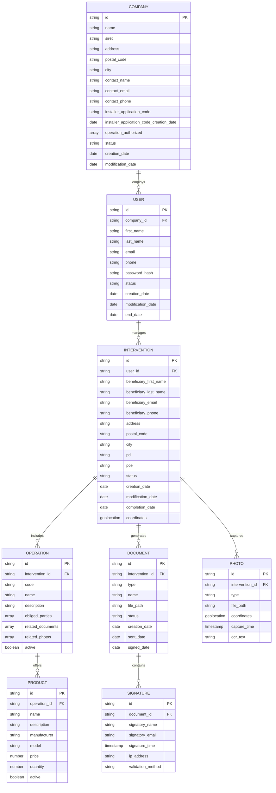

# Data Model

This document provides an introduction to the data model design for the Workforce Automation App, including entity-relationship diagrams and relational mapping.

## Overview

The data model for the Workforce Automation App is designed to support the core business processes of field intervention management, document generation, and integration with external systems. The model prioritizes:

1. **Data Integrity**: Ensuring consistent and accurate data across all aspects of the application
2. **Scalability**: Supporting growth in users, interventions, and product offerings
3. **Performance**: Optimizing for mobile use with appropriate indexing and query patterns
4. **Integration**: Facilitating data exchange with Symphonics and other platforms

## Entity Relationship Diagram

## Key Entities

### Company
Represents installer companies with verification details and permissions.

### User
Represents system users (installers, back office staff, IT) with authentication and status information.

### Intervention
The core entity representing a field intervention, with customer details, location, and status tracking.

### Operation
Represents CEE operations (e.g., BAR-TH-173) that determine document requirements and eligible products.

### Product
Represents physical equipment installed during interventions, with pricing and descriptive information.

### Document
Represents generated documents (quotes, invoices, attestations, contracts) with status tracking.

### Photo
Represents photographic evidence captured during interventions, with geolocation and timestamp metadata.

### Signature
Represents electronic signatures applied to documents, with validation and audit information.

## Relationships

1. **Company to User**: One-to-many relationship where a company employs multiple users.
2. **User to Intervention**: One-to-many relationship where a user manages multiple interventions.
3. **Intervention to Operation**: One-to-many relationship where an intervention includes multiple operations.
4. **Operation to Product**: One-to-many relationship where an operation offers multiple products.
5. **Intervention to Document**: One-to-many relationship where an intervention generates multiple documents.
6. **Intervention to Photo**: One-to-many relationship where an intervention captures multiple photos.
7. **Document to Signature**: One-to-many relationship where a document contains multiple signatures.

## Data Validation Rules

1. **Email Validation**: All email addresses must conform to standard email format.
2. **Phone Validation**: All phone numbers must conform to standard phone format.
3. **PDL/PCE Validation**: PDL and PCE numbers must be validated against Symphonics API.
4. **Status Transitions**: Entity status changes must follow defined state machines.
5. **Required Fields**: Critical fields must be present and valid before status transitions.

## Indexing Strategy

1. **Primary Keys**: All entities have unique string identifiers.
2. **Foreign Keys**: Relationships are maintained through foreign key references.
3. **Search Indexes**: Common search fields (name, email, postal code) are indexed.
4. **Geospatial Indexes**: Location data is indexed for geospatial queries.
5. **Timestamp Indexes**: Date fields are indexed for temporal queries.

## Data Security Considerations

1. **Encryption**: Sensitive data is encrypted at rest and in transit.
2. **Access Control**: Data access is restricted based on user roles and permissions.
3. **Audit Logging**: Changes to critical data are logged for audit purposes.
4. **Data Retention**: Personal data is retained according to GDPR requirements.
5. **Anonymization**: Mechanisms exist for anonymizing personal data upon request.

## Implementation Notes

1. **Database Technology**: The data model is designed to be implemented in a relational database system.
2. **API Layer**: A RESTful API layer will provide access to the data model.
3. **Caching Strategy**: Frequently accessed data will be cached for performance.
4. **Offline Support**: Critical data will be available offline with synchronization mechanisms.
5. **Migration Strategy**: The data model supports versioning and migration for future enhancements.

## Future Considerations

1. **Multi-tenancy**: The data model can be extended to support multi-tenant architecture.
2. **Localization**: Additional fields may be added to support multiple languages and regions.
3. **Analytics**: The data model can be extended with additional fields for advanced analytics.
4. **Integration**: Additional entities may be added to support new integration partners.
5. **Product Expansion**: The model supports expansion to additional product types and operations.
