# Company Management Screen Wireframe

This wireframe illustrates the company management screen for the Workforce Automation App, which allows administrators to create, view, edit, and manage company accounts.

## Screen Layout

## Detailed Components

## State Transition Flow

## UI Mockup - Company List View

```mermaid
%%{init: {'theme': 'base', 'themeVariables': { 'primaryColor': '#f4f4f4', 'primaryTextColor': '#333', 'primaryBorderColor': '#ddd', 'lineColor': '#a0a0a0', 'secondaryColor': '#006699', 'tertiaryColor': '#fff'}}}%%
graph TD
    subgraph CompanyManagementScreen["Company Management Screen"]
        subgraph Sidebar["Sidebar Navigation"]
            Logo["🔧"]
            NavDashboard["Dashboard"]
            NavCompanies["Companies"]
            NavUsers["Users"]
            NavInterventions["Interventions"]
            NavReports["Reports"]
            NavSettings["Settings"]
        end
        
        subgraph Header["Header"]
            Title["Company Management"]
            CreateButton["[ + CREATE COMPANY ]"]
            ExportButton["[ EXPORT ]"]
            UserInfo["Admin User ▼"]
        end
        
        subgraph Filters["Filters & Search"]
            SearchBar["🔍 Search companies..."]
            StatusFilter["Status: All ▼"]
            RegionFilter["Region: All ▼"]
            DateFilter["Date: All Time ▼"]
            ClearButton["Clear Filters"]
        end
        
        subgraph CompanyList["Company List"]
            subgraph TableHeader["Table Header"]
                HeaderName["Company Name ▼"]
                HeaderCode["Code"]
                HeaderStatus["Status"]
                HeaderRegion["Region"]
                HeaderDate["Created"]
                HeaderCount["Interventions"]
                HeaderActions["Actions"]
            end
            
            subgraph Company1["Company Row 1"]
                Company1Name["Électricité Plus"]
                Company1Code["ELECPLUS"]
                Company1Status["Active"]
                Company1Region["Paris"]
                Company1Date["01/15/2025"]
                Company1Count["243"]
                Company1Actions["[ VIEW ] [ EDIT ]"]
            end
            
            subgraph Company2["Company Row 2"]
                Company2Name["Chauffage Expert"]
                Company2Code["CHAUFEXP"]
                Company2Status["Active"]
                Company2Region["Lyon"]
                Company2Date["02/03/2025"]
                Company2Count["127"]
                Company2Actions["[ VIEW ] [ EDIT ]"]
            end
            
            subgraph Company3["Company Row 3"]
                Company3Name["Isolation Pro"]
                Company3Code["ISOPRO"]
                Company3Status["Inactive"]
                Company3Region["Marseille"]
                Company3Date["02/28/2025"]
                Company3Count["56"]
                Company3Actions["[ VIEW ] [ EDIT ]"]
            end
        end
        
        subgraph Pagination["Pagination"]
            PrevButton["< Previous"]
            Page1["1"]
            Page2["2"]
            Page3["3"]
            NextButton["Next >"]
            ItemsPerPage["Items per page: 10 ▼"]
        end
    end
    
    NavDashboard --- NavCompanies
    NavCompanies --- NavUsers
    NavUsers --- NavInterventions
    NavInterventions --- NavReports
    NavReports --- NavSettings
    
    Title --- CreateButton
    CreateButton --- ExportButton
    ExportButton --- UserInfo
    
    SearchBar --- StatusFilter
    StatusFilter --- RegionFilter
    RegionFilter --- DateFilter
    DateFilter --- ClearButton
    
    HeaderName --- HeaderCode
    HeaderCode --- HeaderStatus
    HeaderStatus --- HeaderRegion
    HeaderRegion --- HeaderDate
    HeaderDate --- HeaderCount
    HeaderCount --- HeaderActions
    
    Company1 --- Company2
    Company2 --- Company3
    
    PrevButton --- Page1
    Page1 --- Page2
    Page2 --- Page3
    Page3 --- NextButton
    NextButton --- ItemsPerPage
```

## UI Mockup - Company Detail Modal

```mermaid
%%{init: {'theme': 'base', 'themeVariables': { 'primaryColor': '#f4f4f4', 'primaryTextColor': '#333', 'primaryBorderColor': '#ddd', 'lineColor': '#a0a0a0', 'secondaryColor': '#006699', 'tertiaryColor': '#fff'}}}%%
graph TD
    subgraph CompanyDetailModal["Company Detail Modal"]
        subgraph ModalHeader["Modal Header"]
            ModalTitle["Edit Company: Électricité Plus"]
            CloseButton["×"]
        end
        
        subgraph Tabs["Form Tabs"]
            GeneralTab["General"]
            ContactTab["Contact"]
            OperationsTab["Operations"]
            UsersTab["Users"]
        end
        
        subgraph GeneralSection["General Information"]
            NameLabel["Company Name:"]
            NameInput["Électricité Plus"]
            CodeLabel["Company Code:"]
            CodeInput["ELECPLUS"]
            StatusLabel["Status:"]
            StatusToggle["● Active ○ Inactive"]
            RegionLabel["Region:"]
            RegionSelect["Paris ▼"]
            NotesLabel["Notes:"]
            NotesTextarea["Specialized in electrical installations and repairs."]
        end
        
        subgraph Actions["Actions"]
            SaveButton["[ SAVE CHANGES ]"]
            CancelButton["[ CANCEL ]"]
            DeleteButton["[ DELETE COMPANY ]"]
        end
    end
    
    ModalTitle --- CloseButton
    
    GeneralTab --- ContactTab
    ContactTab --- OperationsTab
    OperationsTab --- UsersTab
    
    NameLabel --- NameInput
    NameInput --- CodeLabel
    CodeLabel --- CodeInput
    CodeInput --- StatusLabel
    StatusLabel --- StatusToggle
    StatusToggle --- RegionLabel
    RegionLabel --- RegionSelect
    RegionSelect --- NotesLabel
    NotesLabel --- NotesTextarea
    
    SaveButton --- CancelButton
    CancelButton --- DeleteButton
```

## UI Mockup - Operations Tab

```mermaid
%%{init: {'theme': 'base', 'themeVariables': { 'primaryColor': '#f4f4f4', 'primaryTextColor': '#333', 'primaryBorderColor': '#ddd', 'lineColor': '#a0a0a0', 'secondaryColor': '#006699', 'tertiaryColor': '#fff'}}}%%
graph TD
    subgraph OperationsTab["Operations Tab"]
        subgraph OperationsHeader["Operations Header"]
            OperationsTitle["Authorized Operations"]
            SelectAllButton["[ SELECT ALL ]"]
            DeselectAllButton["[ DESELECT ALL ]"]
        end
        
        subgraph OperationsList["Operations List"]
            subgraph Operation1["Operation"]
                Op1Checkbox["[✓]"]
                Op1Code["BAR-TH-173"]
                Op1Name["Régulateur de ballon d'eau chaude"]
            end
            
            subgraph Operation2["Operation"]
                Op2Checkbox["[✓]"]
                Op2Code["BAR-TH-171"]
                Op2Name["Thermostat programmable"]
            end
            
            subgraph Operation3["Operation"]
                Op3Checkbox["[ ]"]
                Op3Code["BAR-TH-104"]
                Op3Name["Pompe à chaleur de type air/eau"]
            end
            
            subgraph Operation4["Operation"]
                Op4Checkbox["[ ]"]
                Op4Code["BAR-TH-106"]
                Op4Name["Chaudière individuelle à haute performance énergétique"]
            end
        end
        
        subgraph OperationsFilter["Operations Filter"]
            OpSearchBar["🔍 Search operations..."]
            OpCategoryFilter["Category: All ▼"]
        end
    end
    
    OperationsTitle --- SelectAllButton
    SelectAllButton --- DeselectAllButton
    
    OpSearchBar --- OpCategoryFilter
    
    Operation1 --- Operation2
    Operation2 --- Operation3
    Operation3 --- Operation4
```

## UI Mockup - Users Tab

```mermaid
%%{init: {'theme': 'base', 'themeVariables': { 'primaryColor': '#f4f4f4', 'primaryTextColor': '#333', 'primaryBorderColor': '#ddd', 'lineColor': '#a0a0a0', 'secondaryColor': '#006699', 'tertiaryColor': '#fff'}}}%%
graph TD
    subgraph UsersTab["Users Tab"]
        subgraph UsersHeader["Users Header"]
            UsersTitle["Company Users"]
            InviteButton["[ + INVITE USER ]"]
        end
        
        subgraph UsersList["Users List"]
            subgraph User1["User"]
                User1Avatar["👤"]
                User1Name["Jean Dupont"]
                User1Email["jean.dupont@electriciteplus.fr"]
                User1Role["Admin"]
                User1Status["Active"]
                User1Actions["[ EDIT ] [ REMOVE ]"]
            end
            
            subgraph User2["User"]
                User2Avatar["👤"]
                User2Name["Marie Martin"]
                User2Email["marie.martin@electriciteplus.fr"]
                User2Role["Installer"]
                User2Status["Active"]
                User2Actions["[ EDIT ] [ REMOVE ]"]
            end
            
            subgraph User3["User"]
                User3Avatar["👤"]
                User3Name["Pierre Leroy"]
                User3Email["pierre.leroy@electriciteplus.fr"]
                User3Role["Installer"]
                User3Status["Pending"]
                User3Actions["[ RESEND ] [ REMOVE ]"]
            end
        end
    end
    
    UsersTitle --- InviteButton
    
    User1 --- User2
    User2 --- User3
```

## Specifications

### Layout Specifications
- **Screen Size**: Optimized for desktop (responsive down to tablet)
- **Sidebar Width**: 240px (collapsible to 64px)
- **Header Height**: 64px
- **Filters Height**: 60px
- **Table Row Height**: 56px
- **Modal Width**: 800px (responsive)
- **Modal Max Height**: 80% of viewport height

### Component Specifications

#### Sidebar
- **Logo**: Company logo (SVG format, 32px)
- **Navigation Items**: 
  - Dashboard
  - Companies (active)
  - Users
  - Interventions
  - Reports
  - Settings
- **Active Item**: Primary color background (#006699), white text
- **Inactive Items**: Gray text (#333333)
- **Collapse Button**: Arrow icon to collapse/expand sidebar

#### Header
- **Title**: "Company Management" (24px Roboto Medium)
- **Create Button**: "+ CREATE COMPANY" (14px Roboto Medium)
  - Primary color background (#006699), white text
  - Rounded corners (4px)
- **Export Button**: "EXPORT" (14px Roboto Medium)
  - White background, primary color border and text
  - Rounded corners (4px)
- **User Info**: Username with dropdown for profile actions

#### Filters
- **Search Bar**: Full-width text input with search icon
- **Status Filter**: Dropdown with options (All, Active, Inactive)
- **Region Filter**: Dropdown with regions
- **Date Filter**: Dropdown with date range options
- **Clear Filters**: Text button to reset all filters

#### Company List
- **Table Header**: Column headers with sort indicators
  - Company Name (sortable, default sort)
  - Code
  - Status
  - Region
  - Created Date (sortable)
  - Interventions Count
  - Actions
- **Company Row**: Data row with company information
  - Alternating row background for better readability
  - Hover state with light highlight
- **Status Indicator**:
  - Active: Green dot or pill
  - Inactive: Gray dot or pill
- **Action Buttons**: "VIEW" and "EDIT" text buttons

#### Pagination
- **Page Numbers**: Current page highlighted
- **Previous/Next Buttons**: Enabled/disabled based on current page
- **Items Per Page**: Dropdown selector (10, 25, 50, 100)

#### Company Detail Modal
- **Header**: Title with close button
- **Tabs**: General, Contact, Operations, Users
- **Form Fields**: Appropriate inputs for each data type
  - Text inputs: Company name, code
  - Toggle: Status
  - Dropdown: Region
  - Textarea: Notes
- **Action Buttons**:
  - Save: Primary color background (#006699), white text
  - Cancel: White background, gray border and text
  - Delete: Red background (#DC3545), white text (with confirmation)

### Behavior Specifications

1. **Company List**:
   - Sortable columns (click header to sort)
   - Filterable by search term, status, region, and date
   - Pagination for large datasets
   - Click row or "VIEW" button to view details
   - Click "EDIT" button to open edit modal

2. **Create Company**:
   - Click "+ CREATE COMPANY" to open empty form modal
   - Form validation for required fields
   - Company code must be unique (validated on submit)
   - Success notification on creation

3. **Edit Company**:
   - Form pre-populated with company data
   - Validation for required fields
   - Success notification on save
   - Confirmation dialog for status changes

4. **Delete Company**:
   - Confirmation dialog with warning about associated data
   - Success notification on deletion
   - Redirect to company list after deletion

5. **Operations Management**:
   - Checkbox selection for authorized operations
   - Select/deselect all functionality
   - Search and filter operations
   - Changes saved with main form

6. **User Management**:
   - List of users associated with company
   - Invite new users via email
   - Edit user roles and permissions
   - Remove users from company (with confirmation)
   - Resend invitation for pending users

### Status-Based UI Adaptations

The interface adapts based on the company status:

1. **Active**:
   - Green status indicator
   - All functionality enabled
   - Users can log in

2. **Inactive**:
   - Gray status indicator
   - Warning message when viewing details
   - Users cannot log in
   - Associated interventions marked as requiring attention

### Responsive Behavior

- On smaller desktop screens:
  - Sidebar collapses to icons only
  - Table adapts with horizontal scrolling
  - Modal width reduces to fit screen

- On tablet:
  - Sidebar becomes a hamburger menu
  - Filters stack vertically
  - Table shows fewer columns with option to expand

### Accessibility Considerations

1. **Color Contrast**:
   - All text meets WCAG AA standards for contrast
   - Status indicators have text alternatives

2. **Keyboard Navigation**:
   - Logical tab order
   - Focus indicators for all interactive elements
   - Keyboard shortcuts for common actions

3. **Screen Readers**:
   - All form elements have proper labels
   - Table has appropriate ARIA attributes
   - Modal announces opening and closing
   - Status changes are announced

### Data Management

1. **Data Loading**:
   - Progressive loading for large datasets
   - Skeleton screens during initial load
   - Cached data for recently viewed companies

2. **Data Validation**:
   - Client-side validation for immediate feedback
   - Server-side validation for security
   - Detailed error messages for validation failures

3. **Data Export**:
   - Export to CSV/Excel
   - Configurable columns for export
   - Option to export filtered data or all data

## Implementation Notes

1. Use a responsive grid system for layout
2. Implement proper form validation with clear error messages
3. Use optimistic UI updates for better perceived performance
4. Implement proper error handling for API failures
5. Use appropriate loading states for asynchronous operations
6. Ensure all actions have appropriate confirmation dialogs
7. Implement audit logging for company management actions
8. Use proper authorization checks for administrative actions
