# Dashboard Home Screen Wireframe

This wireframe illustrates the home screen dashboard for the Workforce Automation App, which serves as the main hub for installers to access their interventions and app features.

## Screen Layout

## Detailed Components

## UI Mockup

```mermaid
%%{init: {'theme': 'base', 'themeVariables': { 'primaryColor': '#f4f4f4', 'primaryTextColor': '#333', 'primaryBorderColor': '#ddd', 'lineColor': '#a0a0a0', 'secondaryColor': '#006699', 'tertiaryColor': '#fff'}}}%%
graph TD
    subgraph DashboardScreen["Dashboard Home Screen"]
        subgraph Header["Header"]
            Logo["🔧"]
            AppName["Workforce Automation"]
            UserAvatar["👤"]
            NotificationIcon["🔔"]
        end
        
        subgraph Stats["Statistics Summary"]
            TotalStat["Total: 12"]
            PendingStat["Pending: 5"]
            CompletedStat["Completed: 7"]
        end
        
        subgraph Filters["Filters"]
            FilterAll["All"]
            FilterPending["Pending"]
            FilterInProgress["In Progress"]
            FilterCompleted["Completed"]
            SearchIcon["🔍"]
        end
        
        subgraph InterventionList["Intervention List"]
            subgraph Card1["Intervention Card"]
                Card1Name["Thomas Martin"]
                Card1Address["45 Rue des Fleurs, 75015 Paris"]
                Card1Status["En_cours"]
                Card1Date["Today, 14:30"]
                Card1Icons["🔧"]
            end
            
            subgraph Card2["Intervention Card"]
                Card2Name["Marie Dubois"]
                Card2Address["12 Avenue Victor Hugo, 75016 Paris"]
                Card2Status["A_traiter"]
                Card2Date["Tomorrow, 10:00"]
                Card2Icons["🔧"]
            end
            
            subgraph Card3["Intervention Card"]
                Card3Name["Jean Dupont"]
                Card3Address["8 Rue de Rivoli, 75004 Paris"]
                Card3Status["quote_sent"]
                Card3Date["Yesterday, 16:45"]
                Card3Icons["🔧"]
            end
            
            LoadMore["Load more..."]
        end
        
        FAB["+"]
        
        subgraph NavBar["Navigation Bar"]
            HomeIcon["🏠"]
            CalendarIcon["📅"]
            ProfileIcon["👤"]
            SettingsIcon["⚙️"]
        end
    end
    
    Logo --- AppName
    AppName --- UserAvatar
    UserAvatar --- NotificationIcon
    
    TotalStat --- PendingStat
    PendingStat --- CompletedStat
    
    FilterAll --- FilterPending
    FilterPending --- FilterInProgress
    FilterInProgress --- FilterCompleted
    FilterCompleted --- SearchIcon
    
    Card1 --- Card2
    Card2 --- Card3
    Card3 --- LoadMore
    
    HomeIcon --- CalendarIcon
    CalendarIcon --- ProfileIcon
    ProfileIcon --- SettingsIcon
```

## Specifications

### Layout Specifications
- **Screen Size**: Optimized for mobile (375px width)
- **Header Height**: 60px
- **Stats Height**: 80px
- **Filter Height**: 50px
- **Card Height**: 100px
- **Navigation Bar Height**: 60px
- **Floating Action Button**: 56px diameter

### Component Specifications

#### Header
- **Logo**: Company logo (SVG format, 24px)
- **App Name**: "Workforce Automation" (18px Roboto Medium)
- **User Avatar**: Circular user profile image (32px diameter)
- **Notification Icon**: Bell icon with badge for unread notifications (24px)

#### Statistics Summary
- **Container**: Full width, rounded corners (8px), light background
- **Total Interventions**: Count with label (16px Roboto Medium)
- **Pending Interventions**: Count with label (16px Roboto Medium)
- **Completed Interventions**: Count with label (16px Roboto Medium)
- **Layout**: Horizontal distribution with equal width columns

#### Filters
- **Container**: Full width, horizontal scrollable area
- **Filter Pills**: Rounded pills (24px height, variable width)
  - Active pill: Primary color background (#006699), white text
  - Inactive pill: Light gray background (#f0f0f0), dark text
- **Search Icon**: Magnifying glass icon (24px)

#### Intervention List
- **Container**: Full width, scrollable area
- **Intervention Cards**: Full width, rounded corners (8px), white background, subtle shadow

##### Intervention Card
- **Customer Name**: Bold text (16px Roboto Medium)
- **Address**: Regular text (14px Roboto Regular)
- **Status**: Pill with status-specific color (12px Roboto Medium)
  - A_traiter: Orange (#FFA500)
  - En_cours: Blue (#1E90FF)
  - quote_sent: Purple (#9370DB)
  - quote_signed: Teal (#008080)
  - invoice_sent: Pink (#FF69B4)
  - installation_done: Green (#28a745)
  - published: Dark Green (#006400)
  - canceled: Red (#DC3545)
- **Date**: Gray text (12px Roboto Regular)
- **Operation Icons**: Small icons representing operation types (16px)
- **Tap Action**: Navigate to intervention details

#### Floating Action Button (FAB)
- **Size**: 56px diameter
- **Icon**: Plus sign (24px)
- **Color**: Primary color (#006699)
- **Position**: Bottom right, 16px margin from edges
- **Elevation**: Subtle shadow for depth
- **Action**: Create new intervention

#### Navigation Bar
- **Container**: Full width, fixed at bottom, white background, subtle top shadow
- **Icons**: Home, Calendar, Profile, Settings (24px each)
- **Active Icon**: Primary color (#006699)
- **Inactive Icon**: Gray (#757575)
- **Labels**: Optional small text labels below icons (10px Roboto Regular)

### Behavior Specifications

1. **Header**:
   - User avatar: Tap to view profile
   - Notification icon: Tap to view notifications
   - Badge shows count of unread notifications

2. **Statistics Summary**:
   - Updates in real-time as intervention statuses change
   - Tap on a statistic to filter the list by that status

3. **Filters**:
   - Horizontal scrolling if all filters don't fit on screen
   - Single selection only (mutual exclusivity)
   - Search icon: Tap to expand search input

4. **Intervention List**:
   - Vertical scrolling for the list
   - Pull-to-refresh functionality
   - Load more button appears when more items are available
   - Cards are sorted by date (most recent/urgent first)
   - Swipe actions:
     - Swipe right: Quick status change
     - Swipe left: Quick actions menu (view, edit, etc.)

5. **Floating Action Button**:
   - Tap to create new intervention
   - Scrolls with content but remains visible
   - Optional: Expands to show multiple action options on long press

6. **Navigation Bar**:
   - Fixed at bottom of screen
   - Highlights current active section
   - Provides haptic feedback on tap

7. **Offline Mode**:
   - Visual indicator when offline
   - Cached data still accessible
   - Actions queued for sync when online

### Status-Based Visual Cues

The interface uses consistent color coding to indicate intervention status:

1. **A_traiter**: Orange (#FFA500) - Requires attention
2. **En_cours**: Blue (#1E90FF) - In progress
3. **quote_sent**: Purple (#9370DB) - Awaiting customer action
4. **quote_signed**: Teal (#008080) - Quote approved
5. **invoice_sent**: Pink (#FF69B4) - Invoice pending
6. **installation_done**: Green (#28a745) - Installation complete
7. **published**: Dark Green (#006400) - Published to Symphonics
8. **canceled**: Red (#DC3545) - Canceled

### Responsive Behavior

- On larger screens (tablet):
  - Two-column layout for intervention cards
  - Expanded statistics with additional metrics
  - Persistent search field (not icon-only)

- On desktop:
  - Three-column layout for intervention cards
  - Side navigation instead of bottom navigation
  - Expanded header with additional actions

### Accessibility Considerations

1. **Color Contrast**:
   - All text meets WCAG AA standards for contrast
   - Status colors have text alternatives

2. **Touch Targets**:
   - All interactive elements are at least 44x44px
   - Adequate spacing between touch targets

3. **Screen Readers**:
   - All elements have appropriate labels
   - Status changes are announced
   - Navigation elements have clear roles

4. **Keyboard Navigation**:
   - Logical tab order
   - Focus indicators for all interactive elements

## Implementation Notes

1. Use skeleton screens during loading for better perceived performance
2. Implement efficient list rendering for smooth scrolling
3. Cache intervention data for offline access
4. Use appropriate animations for transitions and interactions
5. Ensure all interactive elements have appropriate feedback states
6. Implement proper error handling for failed data loading
