# Intervention Details Screen Wireframe

This wireframe illustrates the intervention details screen for the Workforce Automation App, which displays comprehensive information about a specific intervention and allows the installer to view and update its status.

## Screen Layout

## Detailed Components

## Status Transition Flow

## UI Element Visibility by Status

## User Interaction Flow

## Photo Capture Flow

## Document Generation Flow

## Error Handling Flow

## UI Mockup - Info Tab

## UI Mockup - Operations Tab

```mermaid
%%{init: {'theme': 'base', 'themeVariables': { 'primaryColor': '#f4f4f4', 'primaryTextColor': '#333', 'primaryBorderColor': '#ddd', 'lineColor': '#a0a0a0', 'secondaryColor': '#006699', 'tertiaryColor': '#fff'}}}%%
graph TD
    subgraph OperationsContent["Operations Content"]
        OperationsTitle["Selected Operations"]
        
        subgraph Operation1["Operation 1"]
            Op1Code["BAR-TH-173"]
            Op1Name["Régulateur de ballon d'eau chaude"]
            Op1Price["Price: 150.00 €"]
            Op1Actions["[ EDIT ] [ REMOVE ]"]
        end
        
        subgraph AddOperation["Add Operation"]
            AddOperationButton["[ + ADD OPERATION ]"]
        end
        
        subgraph PriceSection["Price Summary"]
            SubtotalLabel["Subtotal:"]
            SubtotalValue["150.00 €"]
            TaxLabel["Tax (20%):"]
            TaxValue["30.00 €"]
            TotalLabel["Total:"]
            TotalValue["180.00 €"]
        end
    end
    
    OperationsTitle --- Operation1
    Operation1 --- AddOperation
    AddOperation --- PriceSection
    
    Op1Code --- Op1Name
    Op1Name --- Op1Price
    Op1Price --- Op1Actions
    
    SubtotalLabel --- SubtotalValue
    SubtotalValue --- TaxLabel
    TaxLabel --- TaxValue
    TaxValue --- TotalLabel
    TotalLabel --- TotalValue
```

## UI Mockup - Photos Tab

```mermaid
%%{init: {'theme': 'base', 'themeVariables': { 'primaryColor': '#f4f4f4', 'primaryTextColor': '#333', 'primaryBorderColor': '#ddd', 'lineColor': '#a0a0a0', 'secondaryColor': '#006699', 'tertiaryColor': '#fff'}}}%%
graph TD
    subgraph PhotosContent["Photos Content"]
        PhotosTitle["Required Photos"]
        
        subgraph BeforePhotos["Before Photos"]
            BeforeTitle["Before Installation (1/2)"]
            BeforePhoto1["📷"]
            BeforeAddButton["[ + ADD PHOTO ]"]
        end
        
        subgraph AfterPhotos["After Photos"]
            AfterTitle["After Installation (0/2)"]
            AfterAddButton["[ + ADD PHOTO ]"]
        end
        
        subgraph MeterPhotos["Meter Photos"]
            MeterTitle["Meter (1/1)"]
            MeterPhoto1["📷"]
        end
        
        subgraph AppPhotos["Application Photos"]
            AppTitle["Application (0/1)"]
            AppAddButton["[ + ADD PHOTO ]"]
        end
    end
    
    PhotosTitle --- BeforePhotos
    BeforePhotos --- AfterPhotos
    AfterPhotos --- MeterPhotos
    MeterPhotos --- AppPhotos
    
    BeforeTitle --- BeforePhoto1
    BeforePhoto1 --- BeforeAddButton
    
    AfterTitle --- AfterAddButton
    
    MeterTitle --- MeterPhoto1
    
    AppTitle --- AppAddButton
```

## UI Mockup - Documents Tab

```mermaid
%%{init: {'theme': 'base', 'themeVariables': { 'primaryColor': '#f4f4f4', 'primaryTextColor': '#333', 'primaryBorderColor': '#ddd', 'lineColor': '#a0a0a0', 'secondaryColor': '#006699', 'tertiaryColor': '#fff'}}}%%
graph TD
    subgraph DocumentsContent["Documents Content"]
        DocumentsTitle["Documents"]
        
        subgraph NoDocuments["No Documents"]
            NoDocsMessage["No documents have been generated yet."]
            GenerateButton["[ GENERATE DOCUMENTS ]"]
            GenerateNote["Documents will be generated when all required information and photos are provided."]
        end
        
        subgraph DocumentsList["Documents List (Alternative View)"]
            subgraph Document1["Invoice"]
                Doc1Icon["📄"]
                Doc1Name["Invoice - Thomas Martin - 25/03/2025"]
                Doc1Status["Status: Sent for signature"]
                Doc1Date["Generated: March 25, 2025"]
                Doc1Actions["[ VIEW ] [ SEND ]"]
            end
            
            subgraph Document2["Attestation"]
                Doc2Icon["📄"]
                Doc2Name["Attestation d'Honneur - Thomas Martin"]
                Doc2Status["Status: Draft"]
                Doc2Date["Generated: March 25, 2025"]
                Doc2Actions["[ VIEW ] [ EDIT ]"]
            end
        end
    end
    
    DocumentsTitle --- NoDocuments
    
    NoDocsMessage --- GenerateButton
    GenerateButton --- GenerateNote
    
    %% This is an alternative view that would replace NoDocuments when documents exist
    %% DocumentsTitle --- DocumentsList
    %% Document1 --- Document2
    
    %% Doc1Icon --- Doc1Name
    %% Doc1Name --- Doc1Status
    %% Doc1Status --- Doc1Date
    %% Doc1Date --- Doc1Actions
    
    %% Doc2Icon --- Doc2Name
    %% Doc2Name --- Doc2Status
    %% Doc2Status --- Doc2Date
    %% Doc2Date --- Doc2Actions
```

## Photo Capture Modal

## Document Preview Modal

```mermaid
%%{init: {'theme': 'base', 'themeVariables': { 'primaryColor': '#f4f4f4', 'primaryTextColor': '#333', 'primaryBorderColor': '#ddd', 'lineColor': '#a0a0a0', 'secondaryColor': '#006699', 'tertiaryColor': '#fff'}}}%%
graph TD
    subgraph DocumentPreviewModal["Document Preview Modal"]
        subgraph ModalHeader["Modal Header"]
            ModalTitle["Invoice Preview"]
            CloseButton["×"]
        end
        
        subgraph DocumentView["Document View"]
            DocumentPreview["[PDF Preview]"]
            PageControls["Page 1 of 2  ◀ ▶"]
        end
        
        subgraph Actions["Actions"]
            SendButton["[ SEND FOR SIGNATURE ]"]
            DownloadButton["[ DOWNLOAD ]"]
            EditButton["[ EDIT ]"]
        end
    end
    
    ModalTitle --- CloseButton
    DocumentPreview --- PageControls
    PageControls --- Actions
    SendButton --- DownloadButton
    DownloadButton --- EditButton
```

## Operation Selection Modal

## Notes Edit Modal

```mermaid
%%{init: {'theme': 'base', 'themeVariables': { 'primaryColor': '#f4f4f4', 'primaryTextColor': '#333', 'primaryBorderColor': '#ddd', 'lineColor': '#a0a0a0', 'secondaryColor': '#006699', 'tertiaryColor': '#fff'}}}%%
graph TD
    subgraph NotesEditModal["Notes Edit Modal"]
        subgraph ModalHeader["Modal Header"]
            ModalTitle["Edit Notes"]
            CloseButton["×"]
        end
        
        subgraph NotesForm["Notes Form"]
            NotesTextarea["Customer requested installation before noon. Access code for building: 1234."]
        end
        
        subgraph Actions["Actions"]
            SaveButton["[ SAVE ]"]
            CancelButton["[ CANCEL ]"]
        end
    end
    
    ModalTitle --- CloseButton
    NotesTextarea --- Actions
    SaveButton --- CancelButton
```

## Specifications

### Layout Specifications
- **Screen Size**: Optimized for mobile (375px width)
- **Header Height**: 60px
- **Status Bar Height**: 40px
- **Tabs Height**: 50px
- **Action Bar Height**: 60px
- **Content Area**: Remaining screen height, scrollable

### Component Specifications

#### Header
- **Back Button**: Left-aligned arrow icon (24px)
- **Title**: "Intervention Details" (18px Roboto Medium)
- **Options Button**: Three-dot menu icon (24px)

#### Status Indicator
- **Status Label**: "Status: [status]" with status-specific color (16px Roboto Medium)
  - A_traiter: Gray (#808080)
  - En_cours: Blue (#0066CC)
  - quote_sent: Orange (#FF9900)
  - quote_signed: Light Green (#66CC66)
  - invoice_sent: Orange (#FF9900)
  - installation_done: Green (#00CC00)
  - published: Purple (#9966CC)
  - canceled: Red (#CC0000)
  - maintenance_required: Red (#CC0000)
- **Last Updated**: "Updated: [date/time]" (12px Roboto Regular)

#### Navigation Tabs
- **Container**: Full width, horizontal tabs
- **Tabs**: Equal width, horizontally distributed
  - Active tab: Primary color underline, bold text
  - Inactive tab: No underline, regular text
- **Tab Options**:
  - Info
  - Operations
  - Photos
  - Documents

#### Content Area - Info Tab

##### Customer Information Section
- **Section Title**: "Customer Information" (16px Roboto Medium)
- **Fields**: Name, Email, Phone
- **Labels**: Right-aligned, gray text (14px Roboto Regular)
- **Values**: Left-aligned, black text (14px Roboto Regular)

##### Address Information Section
- **Section Title**: "Address Information" (16px Roboto Medium)
- **Fields**: Address, City, Postal Code
- **Labels**: Right-aligned, gray text (14px Roboto Regular)
- **Values**: Left-aligned, black text (14px Roboto Regular)

##### Intervention Details Section
- **Section Title**: "Intervention Details" (16px Roboto Medium)
- **Fields**: PDL, Scheduled Date, Created Date
- **Labels**: Right-aligned, gray text (14px Roboto Regular)
- **Values**: Left-aligned, black text (14px Roboto Regular)

##### Notes Section
- **Section Title**: "Notes" (16px Roboto Medium)
- **Notes Text**: Multi-line text (14px Roboto Regular)
- **Edit Button**: "Edit Notes" text button (14px Roboto Medium)

#### Content Area - Operations Tab

##### Operations List
- **Section Title**: "Selected Operations" (16px Roboto Medium)
- **Operation Cards**: Full width, rounded corners (8px), white background, subtle shadow

##### Operation Card
- **Code**: CEE operation code (14px Roboto Medium)
- **Name**: Operation name (16px Roboto Regular)
- **Price**: Price with currency (14px Roboto Regular)
- **Action Buttons**: "EDIT" and "REMOVE" text buttons (14px Roboto Medium)

##### Add Operation Button
- **Text**: "+ ADD OPERATION" (16px Roboto Medium)
- **Full width**, 44px height, rounded corners (4px)
- **Border**: Dashed border, primary color
- **Background**: White

##### Price Summary
- **Section Title**: "Price Summary" (16px Roboto Medium)
- **Fields**: Subtotal, Tax, Total
- **Labels**: Left-aligned (14px Roboto Regular)
- **Values**: Right-aligned, bold for total (14px Roboto Medium)

#### Content Area - Photos Tab

##### Photo Categories
- **Section Title**: "Required Photos" (16px Roboto Medium)
- **Category Cards**: Full width, rounded corners (8px), white background, subtle shadow

##### Photo Category Card
- **Title**: Category name with count (16px Roboto Medium)
- **Photos**: Horizontal scrollable area with thumbnails
- **Add Button**: "+ ADD PHOTO" text button (14px Roboto Medium)
- **Thumbnail**: Square image preview (80x80px) with tap to enlarge

#### Content Area - Documents Tab

##### Documents List
- **Section Title**: "Documents" (16px Roboto Medium)
- **Document Cards**: Full width, rounded corners (8px), white background, subtle shadow

##### Document Card
- **Icon**: Document type icon (24px)
- **Name**: Document name (16px Roboto Regular)
- **Status**: Status with color-coding (14px Roboto Regular)
- **Date**: Generation date (12px Roboto Regular)
- **Action Buttons**: "VIEW" and "SEND"/"EDIT" text buttons (14px Roboto Medium)

##### No Documents State
- **Message**: "No documents have been generated yet." (16px Roboto Regular)
- **Generate Button**: "GENERATE DOCUMENTS" button (16px Roboto Medium)
- **Note**: Explanatory text (12px Roboto Italic)

#### Action Buttons
- **Primary Button**: "NEXT STEP" (16px Roboto Medium, uppercase)
- **Secondary Button**: "CANCEL" (16px Roboto Medium, uppercase)
- **Full width**, 48px height, rounded corners (4px)
- **Primary**: Primary color background (#006699), white text
- **Secondary**: White background, primary color border and text

### Behavior Specifications

1. **Header**:
   - Back button: Returns to previous screen
   - Options menu: Opens dropdown with additional actions (edit, delete, etc.)

2. **Status Indicator**:
   - Status label: Color-coded based on status
   - Last updated: Shows relative time (e.g., "Today, 14:30") or date

3. **Navigation Tabs**:
   - Tap to switch between tabs
   - Content area updates to show selected tab
   - Active tab is highlighted
   - Swipe gestures can be used to navigate between tabs

4. **Info Tab**:
   - Read-only display of intervention details
   - Edit notes button opens a text input modal

5. **Operations Tab**:
   - Displays list of selected operations
   - Add operation button opens operation selection screen
   - Edit button opens operation details for editing
   - Remove button prompts for confirmation before removing
   - Price summary updates automatically

6. **Photos Tab**:
   - Organized by required photo categories
   - Shows progress (e.g., "1/2 photos")
   - Add photo button opens camera or photo library
   - Tap on photo to view full-screen
   - Swipe to delete photo (with confirmation)

7. **Documents Tab**:
   - Shows list of generated documents
   - Generate documents button is disabled until all required information is provided
   - View button opens document preview
   - Send button triggers email/SMS delivery
   - Edit button allows modification of document details

8. **Action Buttons**:
   - Primary button action changes based on current status:
     - A_traiter → En_cours: "START INTERVENTION"
     - En_cours → quote_sent: "SEND QUOTE" (if applicable)
     - En_cours → invoice_sent: "SEND INVOICE" (if skipping quote)
     - quote_signed → invoice_sent: "SEND INVOICE"
     - invoice_sent → installation_done: "MARK COMPLETE"
     - installation_done → published: "PUBLISH TO SYMPHONICS"
   - Secondary button: "CANCEL" with confirmation dialog
   - Buttons are disabled during processing operations

### Status-Based UI Adaptations

The interface adapts based on the intervention status:

1. **A_traiter**:
   - All fields are editable
   - Primary action: "START INTERVENTION"
   - No document generation available
   - Photo capture disabled

2. **En_cours**:
   - Customer and address information become read-only
   - Operations can be added/edited
   - Photos can be captured
   - Primary action: "SEND QUOTE" or "SEND INVOICE"
   - Document generation available when all required data is present

3. **quote_sent**:
   - Operations become read-only
   - Documents tab shows quote status
   - Primary action: "RESEND QUOTE"
   - Quote tracking information displayed

4. **quote_signed**:
   - Quote signature details displayed
   - Primary action: "SEND INVOICE"
   - Invoice generation enabled

5. **invoice_sent**:
   - Documents tab shows invoice and signature status
   - Primary action: "MARK COMPLETE"
   - Signature tracking information displayed

6. **installation_done**:
   - All fields become read-only
   - Primary action: "PUBLISH TO SYMPHONICS"
   - Symphonics API validation status displayed

7. **published**:
   - All fields are read-only
   - Shows Symphonics reference number
   - Primary action: "VIEW IN SYMPHONICS"
   - Symphonics sync details displayed

8. **maintenance_required**:
   - Maintenance notes field is editable
   - Primary action: "START MAINTENANCE"
   - Issue details and history displayed

### Responsive Behavior

- On larger screens (tablet):
  - Two-column layout for information sections
  - Larger photo thumbnails (120x120px)
  - Side-by-side display of documents
  - Persistent tabs (no swipe navigation)
  - Floating action buttons

- On desktop:
  - Three-column layout
  - Persistent navigation sidebar
  - Document preview panel
  - Split-view for before/after photos
  - Advanced filtering and sorting options

### Offline Capabilities

1. **Data Storage**:
   - Intervention details cached for offline access
   - Photos stored locally until sync is possible
   - Document templates available offline

2. **Sync Indicators**:
   - Sync status icon in header
   - Last sync timestamp displayed
   - Pending changes count indicator

3. **Background Sync**:
   - Automatic sync when connectivity is restored
   - Priority-based sync (documents first, then photos)
   - Conflict resolution with user prompts

### Accessibility Considerations

1. **Color Contrast**:
   - All text meets WCAG AA standards for contrast
   - Status colors have text alternatives
   - High contrast mode available

2. **Touch Targets**:
   - All interactive elements are at least 44x44px
   - Adequate spacing between touch targets
   - Haptic feedback for important actions

3. **Screen Readers**:
   - All elements have appropriate labels
   - Status changes are announced
   - Tab structure is properly defined
   - Custom actions for photo capture

4. **Keyboard Navigation**:
   - Logical tab order
   - Focus indicators for all interactive elements
   - Keyboard shortcuts for common actions

### Performance Optimizations

1. **Image Handling**:
   - Progressive image loading
   - Thumbnails generated on device
   - Lazy loading for off-screen content
   - Optimized image formats (WebP with JPEG fallback)

2. **UI Responsiveness**:
   - Skeleton screens during loading
   - Background processing for document generation
   - Virtualized lists for large collections
   - Debounced input handlers

3. **Network Efficiency**:
   - Incremental sync of changed data only
   - Compressed data transfer
   - Batch operations for multiple changes
   - Prioritized loading of critical content

## Implementation Notes

1. Use skeleton screens during loading for better perceived performance
2. Implement efficient tab switching without losing scroll position
3. Cache intervention details for offline access
4. Use appropriate animations for transitions and interactions
5. Ensure all interactive elements have appropriate feedback states
6. Implement proper error handling for failed data loading or updates
7. Use draft saving mechanism for partial updates
8. Implement comprehensive validation before status transitions
9. Optimize camera integration for fast photo capture
10. Ensure document generation works with limited connectivity
11. Implement secure storage for sensitive customer information
12. Use appropriate caching strategies for API responses
13. Optimize for variable network conditions (2G/3G/4G/WiFi)
14. Implement analytics for user interaction patterns
15. Use feature flags for gradual rollout of new capabilities
