# Performance Metrics Wireframe

This wireframe illustrates the performance metrics screen for the Workforce Automation App, which provides administrators and managers with detailed analytics on installer and company performance, efficiency metrics, and quality indicators.

## Screen Layout

## Detailed Components

## UI Mockup - Performance Metrics Overview

## UI Mockup - Installer Performance Detail

```mermaid
%%{init: {'theme': 'base', 'themeVariables': { 'primaryColor': '#f4f4f4', 'primaryTextColor': '#333', 'primaryBorderColor': '#ddd', 'lineColor': '#a0a0a0', 'secondaryColor': '#006699', 'tertiaryColor': '#fff'}}}%%
graph TD
    subgraph InstallerDetailView["Installer Performance Detail View"]
        subgraph DetailHeader["Detail Header"]
            DetailTitle["Performance Details: Jean Dupont"]
            DetailPeriod["Period: Last 90 Days"]
            DetailClose["×"]
        end
        
        subgraph InstallerSummary["Installer Summary"]
            InstallerAvatar["👤"]
            InstallerName["Jean Dupont"]
            InstallerCompany["Électricité Plus"]
            InstallerRole["Installer"]
            InstallerStatus["Active since Jan 15, 2024"]
        end
        
        subgraph PerformanceSummary["Performance Summary"]
            DetailInterventions["Total Interventions: 87"]
            DetailTime["Avg. Completion Time: 2.8 days"]
            DetailSuccess["First-Time Success Rate: 95%"]
            DetailRating["Customer Satisfaction: 4.9/5"]
            DetailRank["Rank: #1 of 45 installers"]
        end
        
        subgraph DetailCharts["Performance Charts"]
            subgraph TrendDetail["Performance Trend"]
                TrendDetailGraph["[Line Chart: Monthly Performance]"]
                TrendDetailLegend["Jan: 28 int. | Feb: 29 int. | Mar: 30 int."]
            end
            
            subgraph QualityDetail["Quality Breakdown"]
                QualityDetailGraph["[Radar Chart: Quality Dimensions]"]
                QualityDetailLegend["Documentation: 4.9 | Timeliness: 4.8 | Accuracy: 5.0 | Completeness: 4.9"]
            end
        end
        
        subgraph InterventionTable["Recent Interventions"]
            DetailTableTitle["Recent Interventions"]
            DetailTableHeader["ID | Customer | Date | Operation | Status | Time to Complete | Rating"]
            
            subgraph DetailRow1["Table Row"]
                DetailRow1ID["INT-12345"]
                DetailRow1Customer["Thomas Martin"]
                DetailRow1Date["Mar 15, 2025"]
                DetailRow1Operation["BAR-TH-173"]
                DetailRow1Status["published"]
                DetailRow1Time["2.5 days"]
                DetailRow1Rating["5/5"]
            end
            
            subgraph DetailRow2["Table Row"]
                DetailRow2ID["INT-12346"]
                DetailRow2Customer["Marie Dubois"]
                DetailRow2Date["Mar 16, 2025"]
                DetailRow2Operation["BAR-TH-171"]
                DetailRow2Status["published"]
                DetailRow2Time["3.0 days"]
                DetailRow2Rating["5/5"]
            end
            
            subgraph DetailRow3["Table Row"]
                DetailRow3ID["INT-12458"]
                DetailRow3Customer["Jean Dupont"]
                DetailRow3Date["Mar 20, 2025"]
                DetailRow3Operation["BAR-TH-173"]
                DetailRow3Status["published"]
                DetailRow3Time["2.8 days"]
                DetailRow3Rating["4/5"]
            end
            
            DetailPagination["< 1 2 3 ... 9 >"]
        end
        
        subgraph OperationBreakdown["Operation Breakdown"]
            OperationBreakdownTitle["Performance by Operation Type"]
            
            subgraph OperationBreakdownHeader["Table Header"]
                OpBreakdownHeaderCode["Operation"]
                OpBreakdownHeaderCount["Count"]
                OpBreakdownHeaderTime["Avg. Time"]
                OpBreakdownHeaderSuccess["Success Rate"]
                OpBreakdownHeaderRating["Avg. Rating"]
            end
            
            subgraph OpBreakdownRow1["Table Row"]
                OpBreakdownRow1Code["BAR-TH-173"]
                OpBreakdownRow1Count["45"]
                OpBreakdownRow1Time["2.5 days"]
                OpBreakdownRow1Success["96%"]
                OpBreakdownRow1Rating["4.9/5"]
            end
            
            subgraph OpBreakdownRow2["Table Row"]
                OpBreakdownRow2Code["BAR-TH-171"]
                OpBreakdownRow2Count["32"]
                OpBreakdownRow2Time["3.0 days"]
                OpBreakdownRow2Success["94%"]
                OpBreakdownRow2Rating["4.8/5"]
            end
            
            subgraph OpBreakdownRow3["Table Row"]
                OpBreakdownRow3Code["BAR-TH-104"]
                OpBreakdownRow3Count["10"]
                OpBreakdownRow3Time["3.5 days"]
                OpBreakdownRow3Success["90%"]
                OpBreakdownRow3Rating["4.7/5"]
            end
        end
        
        subgraph FeedbackSection["Customer Feedback"]
            FeedbackTitle["Recent Customer Feedback"]
            
            subgraph Feedback1["Feedback Item"]
                Feedback1Customer["Thomas Martin"]
                Feedback1Date["Mar 15, 2025"]
                Feedback1Rating["★★★★★"]
                Feedback1Comment["Very professional and efficient. Completed the installation quickly and explained everything clearly."]
            end
            
            subgraph Feedback2["Feedback Item"]
                Feedback2Customer["Marie Dubois"]
                Feedback2Date["Mar 16, 2025"]
                Feedback2Rating["★★★★★"]
                Feedback2Comment["Excellent service. Arrived on time and did a perfect job."]
            end
            
            subgraph Feedback3["Feedback Item"]
                Feedback3Customer["Jean Dupont"]
                Feedback3Date["Mar 20, 2025"]
                Feedback3Rating["★★★★☆"]
                Feedback3Comment["Good work overall. Slight delay in arrival but installation was done well."]
            end
        end
    end
    
    DetailTitle --- DetailPeriod
    DetailPeriod --- DetailClose
    
    InstallerAvatar --- InstallerName
    InstallerName --- InstallerCompany
    InstallerCompany --- InstallerRole
    InstallerRole --- InstallerStatus
    
    DetailInterventions --- DetailTime
    DetailTime --- DetailSuccess
    DetailSuccess --- DetailRating
    DetailRating --- DetailRank
    
    TrendDetail --- QualityDetail
    
    DetailTableTitle --- DetailTableHeader
    DetailTableHeader --- DetailRow1
    DetailRow1 --- DetailRow2
    DetailRow2 --- DetailRow3
    DetailRow3 --- DetailPagination
    
    OperationBreakdownTitle --- OperationBreakdownHeader
    OperationBreakdownHeader --- OpBreakdownRow1
    OpBreakdownRow1 --- OpBreakdownRow2
    OpBreakdownRow2 --- OpBreakdownRow3
    
    FeedbackTitle --- Feedback1
    Feedback1 --- Feedback2
    Feedback2 --- Feedback3
```

## UI Mockup - Company Performance Detail

```mermaid
%%{init: {'theme': 'base', 'themeVariables': { 'primaryColor': '#f4f4f4', 'primaryTextColor': '#333', 'primaryBorderColor': '#ddd', 'lineColor': '#a0a0a0', 'secondaryColor': '#006699', 'tertiaryColor': '#fff'}}}%%
graph TD
    subgraph CompanyDetailView["Company Performance Detail View"]
        subgraph CompanyDetailHeader["Detail Header"]
            CompanyDetailTitle["Performance Details: Électricité Plus"]
            CompanyDetailPeriod["Period: Last 90 Days"]
            CompanyDetailClose["×"]
        end
        
        subgraph CompanySummary["Company Summary"]
            CompanyLogo["🏢"]
            CompanyDetailName["Électricité Plus"]
            CompanyDetailCode["ELECPLUS"]
            CompanyDetailRegion["Paris"]
            CompanyDetailStatus["Active since Jan 15, 2024"]
        end
        
        subgraph CompanyPerformanceSummary["Performance Summary"]
            CompanyDetailInterventions["Total Interventions: 243"]
            CompanyDetailTime["Avg. Completion Time: 3.0 days"]
            CompanyDetailSuccess["First-Time Success Rate: 93%"]
            CompanyDetailRating["Customer Satisfaction: 4.8/5"]
            CompanyDetailRank["Rank: #1 of 12 companies"]
        end
        
        subgraph CompanyDetailCharts["Performance Charts"]
            subgraph CompanyTrendDetail["Performance Trend"]
                CompanyTrendGraph["[Line Chart: Monthly Performance]"]
                CompanyTrendLegend["Jan: 78 int. | Feb: 82 int. | Mar: 83 int."]
            end
            
            subgraph CompanyQualityDetail["Quality Breakdown"]
                CompanyQualityGraph["[Radar Chart: Quality Dimensions]"]
                CompanyQualityLegend["Documentation: 4.8 | Timeliness: 4.7 | Accuracy: 4.9 | Completeness: 4.8"]
            end
        end
        
        subgraph InstallerPerformance["Installer Performance"]
            InstallerPerformanceTitle["Installer Performance"]
            
            subgraph InstallerPerformanceHeader["Table Header"]
                InstallerHeaderName["Name"]
                InstallerHeaderInterventions["Interventions"]
                InstallerHeaderTime["Avg. Time"]
                InstallerHeaderSuccess["Success Rate"]
                InstallerHeaderRating["Rating"]
                InstallerHeaderTrend["Trend"]
            end
            
            subgraph InstallerRow1["Table Row"]
                InstallerRow1Name["Jean Dupont"]
                InstallerRow1Interventions["87"]
                InstallerRow1Time["2.8 days"]
                InstallerRow1Success["95%"]
                InstallerRow1Rating["4.9/5"]
                InstallerRow1Trend["↑"]
            end
            
            subgraph InstallerRow2["Table Row"]
                InstallerRow2Name["Marie Martin"]
                InstallerRow2Interventions["76"]
                InstallerRow2Time["3.0 days"]
                InstallerRow2Success["93%"]
                InstallerRow2Rating["4.8/5"]
                InstallerRow2Trend["→"]
            end
            
            subgraph InstallerRow3["Table Row"]
                InstallerRow3Name["Philippe Dubois"]
                InstallerRow3Interventions["65"]
                InstallerRow3Time["3.2 days"]
                InstallerRow3Success["91%"]
                InstallerRow3Rating["4.7/5"]
                InstallerRow3Trend["↑"]
            end
            
            InstallerPagination["< 1 2 >"]
        end
        
        subgraph CompanyOperationBreakdown["Operation Breakdown"]
            CompanyOperationTitle["Performance by Operation Type"]
            
            subgraph CompanyOperationHeader["Table Header"]
                CompanyOpHeaderCode["Operation"]
                CompanyOpHeaderCount["Count"]
                CompanyOpHeaderTime["Avg. Time"]
                CompanyOpHeaderSuccess["Success Rate"]
                CompanyOpHeaderRating["Avg. Rating"]
            end
            
            subgraph CompanyOpRow1["Table Row"]
                CompanyOpRow1Code["BAR-TH-173"]
                CompanyOpRow1Count["125"]
                CompanyOpRow1Time["2.7 days"]
                CompanyOpRow1Success["94%"]
                CompanyOpRow1Rating["4.8/5"]
            end
            
            subgraph CompanyOpRow2["Table Row"]
                CompanyOpRow2Code["BAR-TH-171"]
                CompanyOpRow2Count["85"]
                CompanyOpRow2Time["3.1 days"]
                CompanyOpRow2Success["92%"]
                CompanyOpRow2Rating["4.7/5"]
            end
            
            subgraph CompanyOpRow3["Table Row"]
                CompanyOpRow3Code["BAR-TH-104"]
                CompanyOpRow3Count["33"]
                CompanyOpRow3Time["3.8 days"]
                CompanyOpRow3Success["89%"]
                CompanyOpRow3Rating["4.6/5"]
            end
        end
        
        subgraph IssuesSection["Quality Issues"]
            IssuesTitle["Recent Quality Issues"]
            
            subgraph Issue1["Issue Item"]
                Issue1Date["Mar 10, 2025"]
                Issue1Type["Documentation Error"]
                Issue1Installer["Philippe Dubois"]
                Issue1Description["Missing photos in documentation for intervention INT-12440"]
                Issue1Status["Resolved"]
            end
            
            subgraph Issue2["Issue Item"]
                Issue2Date["Mar 15, 2025"]
                Issue2Type["Installation Issue"]
                Issue2Installer["Marie Martin"]
                Issue2Description["Customer reported thermostat not functioning properly after installation"]
                Issue2Status["In Progress"]
            end
            
            subgraph Issue3["Issue Item"]
                Issue3Date["Mar 18, 2025"]
                Issue3Type["Scheduling Delay"]
                Issue3Installer["Philippe Dubois"]
                Issue3Description["Intervention delayed by 2 days due to parts availability"]
                Issue3Status["Resolved"]
            end
        end
    end
    
    CompanyDetailTitle --- CompanyDetailPeriod
    CompanyDetailPeriod --- CompanyDetailClose
    
    CompanyLogo --- CompanyDetailName
    CompanyDetailName --- CompanyDetailCode
    CompanyDetailCode --- CompanyDetailRegion
    CompanyDetailRegion --- CompanyDetailStatus
    
    CompanyDetailInterventions --- CompanyDetailTime
    CompanyDetailTime --- CompanyDetailSuccess
    CompanyDetailSuccess --- CompanyDetailRating
    CompanyDetailRating --- CompanyDetailRank
    
    CompanyTrendDetail --- CompanyQualityDetail
    
    InstallerPerformanceTitle --- InstallerPerformanceHeader
    InstallerPerformanceHeader --- InstallerRow1
    InstallerRow1 --- InstallerRow2
    InstallerRow2 --- InstallerRow3
    InstallerRow3 --- InstallerPagination
    
    CompanyOperationTitle --- CompanyOperationHeader
    CompanyOperationHeader --- CompanyOpRow1
    CompanyOpRow1 --- CompanyOpRow2
    CompanyOpRow2 --- CompanyOpRow3
    
    IssuesTitle --- Issue1
    Issue1 --- Issue2
    Issue2 --- Issue3
```

## UI Mockup - Operation Performance Detail

```mermaid
%%{init: {'theme': 'base', 'themeVariables': { 'primaryColor': '#f4f4f4', 'primaryTextColor': '#333', 'primaryBorderColor': '#ddd', 'lineColor': '#a0a0a0', 'secondaryColor': '#006699', 'tertiaryColor': '#fff'}}}%%
graph TD
    subgraph OperationDetailView["Operation Performance Detail View"]
        subgraph OperationDetailHeader["Detail Header"]
            OperationDetailTitle["Performance Details: BAR-TH-173"]
            OperationDetailPeriod["Period: Last 90 Days"]
            OperationDetailClose["×"]
        end
        
        subgraph OperationSummary["Operation Summary"]
            OperationIcon["🔧"]
            OperationDetailCode["BAR-TH-173"]
            OperationDetailName["Régulateur de ballon d'eau chaude"]
            OperationDetailDescription["Installation d'un régulateur sur un ballon d'eau chaude électrique existant permettant un pilotage de la mise en température en fonction des besoins."]
        end
        
        subgraph OperationPerformanceSummary["Performance Summary"]
            OperationDetailInterventions["Total Interventions: 245"]
            OperationDetailTime["Avg. Completion Time: 2.5 days"]
            OperationDetailSuccess["First-Time Success Rate: 94%"]
            OperationDetailRating["Customer Satisfaction: 4.8/5"]
            OperationDetailIssues["Quality Issues: 12"]
        end
        
        subgraph OperationDetailCharts["Performance Charts"]
            subgraph OperationTrendDetail["Performance Trend"]
                OperationTrendGraph["[Line Chart: Monthly Performance]"]
                OperationTrendLegend["Jan: 80 int. | Feb: 82 int. | Mar: 83 int."]
            end
            
            subgraph OperationCompanyDetail["Company Comparison"]
                OperationCompanyGraph["[Bar Chart: Top Companies]"]
                OperationCompanyLegend["Électricité Plus: 125 | Chauffage Expert: 85 | Isolation Pro: 35"]
            end
        end
        
        subgraph CompanyOperationPerformance["Company Performance"]
            CompanyOperationTitle["Company Performance for BAR-TH-173"]
            
            subgraph CompanyOperationHeader["Table Header"]
                CompanyOperationHeaderName["Company"]
                CompanyOperationHeaderCount["Count"]
                CompanyOperationHeaderTime["Avg. Time"]
                CompanyOperationHeaderSuccess["Success Rate"]
                CompanyOperationHeaderRating["Rating"]
            end
            
            subgraph CompanyOperationRow1["Table Row"]
                CompanyOperationRow1Name["Électricité Plus"]
                CompanyOperationRow1Count["125"]
                CompanyOperationRow1Time["2.5 days"]
                CompanyOperationRow1Success["95%"]
                CompanyOperationRow1Rating["4.9/5"]
            end
            
            subgraph CompanyOperationRow2["Table Row"]
                CompanyOperationRow2Name["Chauffage Expert"]
                CompanyOperationRow2Count["85"]
                CompanyOperationRow2Time["2.7 days"]
                CompanyOperationRow2Success["93%"]
                CompanyOperationRow2Rating["4.8/5"]
            end
            
            subgraph CompanyOperationRow3["Table Row"]
                CompanyOperationRow3Name["Isolation Pro"]
                CompanyOperationRow3Count["35"]
                CompanyOperationRow3Time["2.9 days"]
                CompanyOperationRow3Success["91%"]
                CompanyOperationRow3Rating["4.7/5"]
            end
        end
        
        subgraph InstallerOperationPerformance["Installer Performance"]
            InstallerOperationTitle["Top Installers for BAR-TH-173"]
            
            subgraph InstallerOperationHeader["Table Header"]
                InstallerOperationHeaderName["Installer"]
                InstallerOperationHeaderCompany["Company"]
                InstallerOperationHeaderCount["Count"]
                InstallerOperationHeaderTime["Avg. Time"]
                InstallerOperationHeaderSuccess["Success Rate"]
            end
            
            subgraph InstallerOperationRow1["Table Row"]
                InstallerOperationRow1Name["Jean Dupont"]
                InstallerOperationRow1Company["Électricité Plus"]
                InstallerOperationRow1Count["45"]
                InstallerOperationRow1Time["2.3 days"]
                InstallerOperationRow1Success["96%"]
            end
            
            subgraph InstallerOperationRow2["Table Row"]
                InstallerOperationRow2Name["Marie Martin"]
                InstallerOperationRow2Company["Électricité Plus"]
                InstallerOperationRow2Count["38"]
                InstallerOperationRow2Time["2.5 days"]
                InstallerOperationRow2Success["95%"]
            end
            
            subgraph InstallerOperationRow3["Table Row"]
                InstallerOperationRow3Name["Pierre Leroy"]
                InstallerOperationRow3Company["Chauffage Expert"]
                InstallerOperationRow3Count["32"]
                InstallerOperationRow3Time["2.6 days"]
                InstallerOperationRow3Success["94%"]
            end
        end
        
        subgraph OperationIssuesSection["Common Issues"]
            OperationIssuesTitle["Common Issues"]
            
            subgraph OperationIssue1["Issue Item"]
                OperationIssue1Type["Installation Error"]
                OperationIssue1Count["5 occurrences"]
                OperationIssue1Description["Incorrect wiring of regulator"]
                OperationIssue1Solution["Provide updated installation guide with clear wiring diagrams"]
            end
            
            subgraph OperationIssue2["Issue Item"]
                OperationIssue2Type["Documentation Error"]
                OperationIssue2Count["4 occurrences"]
                OperationIssue2Description["Missing before/after photos"]
                OperationIssue2Solution["Add photo requirement checklist to mobile app"]
            end
            
            subgraph OperationIssue3["Issue Item"]
                OperationIssue3Type["Parts Issue"]
                OperationIssue3Count["3 occurrences"]
                OperationIssue3Description["Regulator compatibility with older water heaters"]
                OperationIssue3Solution["Provide compatibility guide for different water heater models"]
            end
        end
    end
    
    OperationDetailTitle --- OperationDetailPeriod
    OperationDetailPeriod --- OperationDetailClose
    
    OperationIcon --- OperationDetailCode
    OperationDetailCode --- OperationDetailName
    OperationDetailName --- OperationDetailDescription
    
    OperationDetailInterventions --- OperationDetailTime
    OperationDetailTime --- OperationDetailSuccess
    OperationDetailSuccess --- OperationDetailRating
    OperationDetailRating --- OperationDetailIssues
    
    OperationTrendDetail --- OperationCompanyDetail
    
    CompanyOperationTitle --- CompanyOperationHeader
    CompanyOperationHeader --- CompanyOperationRow1
    CompanyOperationRow1 --- CompanyOperationRow2
    CompanyOperationRow2 --- CompanyOperationRow3
    
    InstallerOperationTitle --- InstallerOperationHeader
    InstallerOperationHeader --- InstallerOperationRow1
    InstallerOperationRow1 --- InstallerOperationRow2
    InstallerOperationRow2 --- InstallerOperationRow3
    
    OperationIssuesTitle --- OperationIssue1
    OperationIssue1 --- OperationIssue2
    OperationIssue2 --- OperationIssue3
```

## Specifications

### Layout Specifications
- **Screen Size**: Optimized for desktop (responsive down to tablet)
- **Sidebar Width**: 240px (collapsible to 64px)
- **Header Height**: 64px
- **Filters Height**: 60px
- **KPI Section Height**: 120px
- **Chart Section Height**: Flexible, approximately 400px
- **Table Section Height**: Flexible, approximately 400px

### Component Specifications

#### Sidebar
- **Logo**: Company logo (SVG format, 32px)
- **Navigation Items**: 
  - Dashboard
  - Companies
  - Users
  - Interventions
  - Reports (active)
  - Settings
- **Active Item**: Primary color background (#006699), white text
- **Inactive Items**: Gray text (#333333)
- **Collapse Button**: Arrow icon to collapse/expand sidebar

#### Header
- **Title**: "Performance Metrics" (24px Roboto Medium)
- **Export Button**: "EXPORT" (14px Roboto Medium)
  - White background, primary color border and text
  - Dropdown with format options (PDF, Excel, CSV)
- **Print Button**: "PRINT" (14px Roboto Medium)
  - White background, primary color border and text
- **Refresh Button**: "REFRESH" (14px Roboto Medium)
  - White background, primary color border and text
  - Shows last refresh time on hover
- **User Info**: Username with dropdown for profile actions

#### Filters
- **Date Range Picker**: Dropdown with preset ranges and custom option
  - Last 30 Days, Last 90 Days, Last 6 Months, Last Year, Custom
- **Company Filter**: Dropdown with companies
- **Region Filter**: Dropdown with regions
- **Installer Filter**: Dropdown with installers
- **Operation Type Filter**: Dropdown with operation types
- **Apply Button**: "APPLY" button to apply selected filters

#### KPI Section
- **KPI Cards**: Four cards showing key metrics
  - Average Completion Time: Days with trend indicator
  - Interventions Per Day: Count with trend indicator
  - First-Time Success Rate: Percentage with trend indicator
  - Customer Satisfaction: Rating with trend indicator
- **Card Design**:
  - White background, subtle shadow
  - Large value (24px Roboto Medium)
  - Trend indicator with color (green for positive, red for negative)
  - Comparison with previous period

#### Charts Section
- **Performance Trend**: Line chart showing performance metrics over time
  - Multiple series (volume, time, success rate, satisfaction)
  - Time grouping options (daily, weekly, monthly)
- **Company Comparison**: Bar chart showing top companies by performance
  - Sortable by different metrics (time, volume, quality)
  - Comparison with average
- **Quality Metrics**: Radar chart showing quality dimensions
  - Documentation, Timeliness, Accuracy, Completeness
  - Comparison with average or target
- **Efficiency Metrics**: Scatter plot showing time vs. volume
  - Each point represents a company or installer
  - Size represents quality score
  - Hover for details

#### Performance Tables
- **Top Performers Table**: Table showing top installers
  - Columns: Name, Company, Interventions, Avg. Time, Success Rate, Rating
  - Sortable columns
  - Click row to view detailed performance
- **Performance by Operation Table**: Table showing performance by operation type
  - Columns: Code, Operation, Count, Avg. Time, Success Rate, Issues
  - Sortable columns
  - Click row to view operation details

### Behavior Specifications

1. **Performance Overview**:
   - All metrics and charts update based on selected filters
   - KPIs show comparison with previous equivalent period
   - Charts are interactive with hover tooltips
   - Click on chart elements to drill down for more details

2. **Filtering**:
   - Date range selection affects all metrics and charts
   - Company, region, installer, and operation filters can be combined
   - Apply button updates all components
   - Clear filters option available

3. **Drill-Down Views**:
   - Click on installer name to view detailed installer performance
   - Click on company name to view detailed company performance
   - Click on operation to view detailed operation performance
   - Each detail view provides comprehensive performance analysis

4. **Installer Performance Detail**:
   - Shows comprehensive information about installer performance
   - Performance trend over time
   - Quality breakdown by dimension
   - Recent interventions with ratings
   - Operation breakdown
   - Customer feedback

5. **Company Performance Detail**:
   - Shows comprehensive information about company performance
   - Performance trend over time
   - Quality breakdown by dimension
   - Installer performance within company
   - Operation breakdown
   - Quality issues

6. **Operation Performance Detail**:
   - Shows comprehensive information about operation performance
   - Performance trend over time
   - Company comparison
   - Top installers for the operation
   - Common issues and solutions

7. **Export Options**:
   - Export entire report or specific sections
   - Format options include PDF, Excel, and CSV
   - Option to include or exclude specific sections
   - Email report directly to stakeholders

### Detailed Views

1. **Installer Performance Detail**:
   - Installer information and summary
   - Performance metrics with ranking
   - Performance trend over time
   - Quality breakdown by dimension
   - Recent interventions with ratings
   - Operation breakdown
   - Customer feedback

2. **Company Performance Detail**:
   - Company information and summary
   - Performance metrics with ranking
   - Performance trend over time
   - Quality breakdown by dimension
   - Installer performance within company
   - Operation breakdown
   - Quality issues

3. **Operation Performance Detail**:
   - Operation information and description
   - Performance metrics
   - Performance trend over time
   - Company comparison
   - Top installers for the operation
   - Common issues and solutions

### Responsive Behavior

- On smaller desktop screens:
  - Sidebar collapses to icons only
  - Charts resize proportionally
  - KPIs maintain size but rearrange if needed

- On tablet:
  - Sidebar becomes a hamburger menu
  - Charts stack vertically
  - KPIs stack in 2x2 grid
  - Tables become scrollable horizontally

### Accessibility Considerations

1. **Color Contrast**:
   - All text meets WCAG AA standards for contrast
   - Charts use colorblind-friendly palettes
   - Alternative text representations for all visual data

2. **Keyboard Navigation**:
   - Logical tab order
   - Focus indicators for all interactive elements
   - Keyboard shortcuts for common actions

3. **Screen Readers**:
   - All charts have appropriate ARIA labels
   - Data tables have proper headers and structure
   - Summary text alternatives for complex visualizations

### Data Management

1. **Data Loading**:
   - Progressive loading for large datasets
   - Skeleton screens during initial load
   - Cached data for recently viewed metrics

2. **Data Aggregation**:
   - Automatic aggregation for different time periods
   - Hierarchical aggregation (installer → company → global)
   - Statistical calculations for trends and comparisons

3. **Data Freshness**:
   - Clear indication of data freshness (last updated time)
   - Option to set automatic refresh intervals
   - Cache invalidation on data updates

## Implementation Notes

1. Use a responsive dashboard framework for layout
2. Implement efficient data visualization libraries
3. Use data caching for improved performance
4. Implement proper error handling for data loading failures
5. Use appropriate loading states for asynchronous operations
6. Ensure all charts have proper legends and tooltips
7. Implement drill-down functionality for all metrics
8. Use proper color coding for performance indicators
9. Ensure all tables have proper sorting and filtering
10. Implement efficient data export functionality
